# WordPress 工作坊

## Day 1

教育部公民營計劃

講師：Eric Wu

2026 年 8 月 3 日

<!--
開場前先確認：投影設備、學員 Wi-Fi 連線、每個人都帶了筆電。
建議開場 5 分鐘內就讓學員打開瀏覽器，避免後面操作環節才發現電腦有問題。
-->

---
layout: center
class: text-center
---

# I'm Eric

<div class="text-left max-w-md mx-auto mt-8">

- 目前任職於線上教育平台
- 專長：AI、WordPress、ChatBot
- 共同籌辦 WordCamp Taiwan、WordCamp Asia
- Facebook：[fb.me/eric0324](https://fb.me/eric0324)
- 個人網站：[ericwu.asia](https://ericwu.asia)

</div>

<!--
自我介紹控制在 3 分鐘內。
可以順便請學員舉手回答：「有架過網站的請舉手」「有用過痞客邦／Wix 的請舉手」，快速掌握學員程度。
-->

---

# 三天工作坊學習地圖

| 天數 | 主題 | 你會得到什麼 |
|------|------|--------------|
| **Day 1** | 架站基礎到佈景主題 | 一個 WordPress 網站，學會購買網域、換上佈景主題 |
| **Day 2** | 外掛功能擴充 | 用各種外掛讓網站功能變強大 |
| **Day 3** | 用 AI 完成功能與持續經營 | 用 AI 做出想要的功能、經營心法與成果分享 |

<v-click>

 **今天最重要**：Day 1 是地基，後面兩天都建立在今天的成果上。

</v-click>

<!--
強調：今天的操作步驟最多、也最容易卡關，請學員跟著做、不要急。
如果今天網站沒架起來，Day 2、Day 3 會跟不上，所以今天會保留充足的實作與排錯時間。
-->

---
layout: center
---

# 結束後，你會擁有

<div class="text-left max-w-lg mx-auto mt-6">

- 一個你**親手安裝**、實際運作的 WordPress 網站
- 可以**隨時發佈內容**的後台
- 換上**專業佈景主題**的版面
- 用**外掛**擴充功能（Day 2）
- 用 **AI 做出想要的功能**、持續經營（Day 3）

</div>

<!--
這頁可以現場示範一個用相同流程做好的範例網站，讓學員有具體想像。
提醒：這不是「練習用」網站，是課程結束後可以直接拿來用的正式網站。
-->

---

# 今日課表

| 時間 | 內容 |
|------|------|
| 08:00–10:00 | **第 01 堂** 開始前的準備 |
| 10:00–12:00 | **第 02 堂** 啟動 WordPress 網站（含 FTP 安裝） |
| 12:00–13:00 |  午餐 |
| 13:00–15:00 | **第 03 堂** 認識 WordPress + 實作 |
| 15:00–17:00 | **第 04 堂** 佈景主題 + 實作 |

<!--
時間為佔位，依實際課表調整。
第 02 堂節奏：網域/DNS/SSL 由講師示範，學員動手做 FTP 安裝 WordPress（核心實作）。
第 04 堂佈景主題操作簡單、成就感高，適合放在下午尾段。
-->

---

# 事前準備檢查 

開始之前，請確認你有：

- **筆電**（Windows / Mac 都可以）
- **瀏覽器**（Chrome、Edge、Firefox、Safari 等常見的都可以）
- **一個常用的 LLM 服務**（Claude、Gemini、ChatGPT 擇一）
- **已連上教室 Wi-Fi**

<v-click>

 今天用**講師提供的主機**實作，不需要信用卡、也不用先註冊任何服務。

</v-click>

<!--
常見狀況：
1. 學員只帶平板，FTP 操作會很辛苦，盡量協助借筆電。
2. LLM 服務用 Claude／Gemini／ChatGPT 免費版即可，Day 3 用 AI 做功能時會用到，請學員先登入備妥。
3. 強調：今天不用花錢、不用綁卡，講師會發給每位主機與子網域的連線資訊。
-->

---

# 上課方式與約定

- **隨時舉手**：卡關超過 2 分鐘就舉手，不要自己硬撐
- **先看再做**：每個步驟我會先示範一次，再請大家操作
- **鄰座互助**：做完的老師幫忙看一下旁邊的進度
- **投影片會提供**：不用抄筆記，專心跟上操作

<v-click>

 **教學現場提示**：這套「示範 → 操作 → 互助」的節奏，也很適合帶回自己的課堂運用。

</v-click>

<!--
建立「卡關就舉手」的文化很重要，很多老師會不好意思發問。
可以指定幾位進度快的學員當「小助教」，分散講師壓力。
-->

---
layout: center
class: text-center
---

# 準備好了嗎？

我們從「WordPress 到底是什麼」開始

<!--
轉場頁。確認大家設備都沒問題後再往下走。
-->

---
layout: section
---

# 第 01 堂
# 開始前的準備

認識 WordPress・為什麼選它・需要準備什麼

<!--
第 01 堂以觀念為主，沒有操作，節奏可以輕鬆一點，多用提問互動。
-->

---

# 1-1 WordPress 是什麼？

**WordPress 是一套「內容管理系統」（CMS, Content Management System）**

<v-clicks>

- 把「寫內容」和「寫程式」分開：你只管寫，系統幫你變成網頁
- 就像 Word 之於文件：你不需要懂排版引擎，也能做出漂亮文件
- 有後台可以登入，新增文章、上傳圖片、調整版面，**全程不用寫程式**

</v-clicks>

<!--
比喻：CMS 就像「網站版的 Word + 檔案櫃」。
常見問題：「跟寫 HTML 網頁有什麼不一樣？」HTML 是手工打造每一頁，CMS 是系統幫你管理所有頁面。
-->

---

# WordPress 網站可以用來？

幾乎什麼都行：
- **個人品牌／部落格**：分享專業、累積內容，接案與邀約的門面
- **公司／品牌官網**：服務介紹、形象展示、聯絡表單
- **作品集**：設計、攝影、寫作……一個網址秀出全部
- **社團／活動網站**：報名、公告、成果發表
- **線上商店**：賣商品、收訂單

<v-click>

**而且內容會一直累積、跟著你走，不會因為平台關閉而消失。**

</v-click>

<!--
請學員想一想：「你想用今天架的網站做什麼？」可以快速請 2-3 位分享。
讓每個人帶著具體目標操作，學習動機會強很多，Day 3 的內容經營也會更有方向。
-->

---

# 1-2 為什麼選 WordPress？

<v-clicks>

- **開源免費**：軟體本身不用錢，只付伺服器與網域費用
- **佈景主題生態**：數千種版型，不會設計也能有專業外觀
- **外掛生態**：表單、相簿、電商……要什麼功能裝什麼
- **社群資源豐富**：中文教學、書籍、論壇都很多
- **不被平台綁架**：資料在自己手上，隨時可以搬家

</v-clicks>

<!--
「不被平台綁架」是關鍵賣點，下一頁會展開對比。
可以問學員：「有沒有人經歷過無名小站關站？」通常會引起共鳴。
-->

---

# WordPress 有多普及？

- 2003 年誕生，發展超過 20 年
- **全球 41.5% 的網站**都用 WordPress；在所有 CMS 中**市佔近 6 成（約 59%）**
- 從個人部落格、學校網站，到新聞媒體、企業官網都在用
- 因為夠普及，**遇到問題幾乎都搜尋得到答案**

<div class="flex items-center justify-center gap-10 mt-4">

<div style="width:210px;height:210px;border-radius:50%;box-shadow:0 2px 12px rgba(0,0,0,0.12);background:conic-gradient(#0073aa 0 59.3%,#00a0d2 59.3% 66.8%,#66c5e3 66.8% 72.9%,#f0a500 72.9% 76.4%,#e0563f 76.4% 78.1%,#cbd5e1 78.1% 100%)"></div>

<div class="text-sm space-y-2">
  <div class="flex items-center gap-2"><span class="inline-block w-3 h-3 rounded-sm" style="background:#0073aa"></span><b>WordPress</b><span class="text-gray-400 ml-auto pl-4">59.3%</span></div>
  <div class="flex items-center gap-2"><span class="inline-block w-3 h-3 rounded-sm" style="background:#00a0d2"></span>Shopify<span class="text-gray-400 ml-auto pl-4">7.5%</span></div>
  <div class="flex items-center gap-2"><span class="inline-block w-3 h-3 rounded-sm" style="background:#66c5e3"></span>Wix<span class="text-gray-400 ml-auto pl-4">6.1%</span></div>
  <div class="flex items-center gap-2"><span class="inline-block w-3 h-3 rounded-sm" style="background:#f0a500"></span>Squarespace<span class="text-gray-400 ml-auto pl-4">3.5%</span></div>
  <div class="flex items-center gap-2"><span class="inline-block w-3 h-3 rounded-sm" style="background:#e0563f"></span>Joomla<span class="text-gray-400 ml-auto pl-4">1.7%</span></div>
  <div class="flex items-center gap-2"><span class="inline-block w-3 h-3 rounded-sm" style="background:#cbd5e1"></span>其他 CMS<span class="text-gray-400 ml-auto pl-4">21.9%</span></div>
</div>

</div>
<div class="text-xs text-gray-400 mt-3 text-center">資料來源：W3Techs，2026 年 6 月（CMS 市佔率）</div>

<!--
這張長條圖用程式畫，數據是 2026 年 6 月 W3Techs 的「佔全球所有網站」比例，可隨時更新數字。
WordPress 41.5% 遙遙領先第二名 Shopify（5.2%），視覺上一目了然。
注意兩個數字的差別：「41.5%」是占「所有網站」；「近 6 成」是占「有用 CMS 的網站」。
重點是傳達：選 WordPress 不是冷門選擇，遇到問題 Google 一下幾乎都有解。
-->

---

# 和熟悉的平台比一比

| | 痞客邦 | Wix | Google Sites | **WordPress** |
|---|---|---|---|---|
| 自己的網域 | 需付費 | 需付費 | 受限 | 完全支援（網域費另計） |
| 廣告 | 強制顯示 | 免費版有 | 無 | 無 |
| 功能擴充 | 不可 | 有限 | 很有限 | 數萬外掛 |
| 資料搬家 | 困難 | 困難 | 普通 | 完整匯出 |
| 平台關閉風險 | 高 | 高 | 中 | 低（資料在自己手上） |

<!--
不是說那些平台不好，Google Sites 拿來做快速的班級公告頁很方便。
重點是：如果要「長期經營、累積內容」，WordPress 的自主權最完整。
無名小站、Yahoo 部落格關站的歷史案例很有說服力。
-->

---
layout: two-cols
---

# WordPress.org

**自架版（本課程使用）**

- 軟體**開源免費**
- 自己準備伺服器與網域
- **完全的控制權**：佈景、外掛、資料都是你的
- 彈性大，學起來終身受用

::right::

# WordPress.com

**託管版（商業服務）**

- 由 Automattic 公司營運
- 免費方案限制多（廣告、不能裝外掛）
- 進階功能要付月費
- 資料放在別人的平台上

<!--
常見混淆點！很多學員回家自己 Google「WordPress」會註冊到 .com 版。
請學員記住：本課程用的是 .org 自架版，軟體免費，我們自己租伺服器來裝。
比喻：.org 是「買食材自己煮」，.com 是「去餐廳點套餐」。
-->

---

# 1-3 開始前的準備：先想清楚

開始架站前，先回答幾個問題：

## 這個網站，是要做什麼用的？

- 個人品牌、作品集、部落格、商店、活動網站（回想前面那頁）
- 想清楚「目的」和「給誰看」，後面選網域、佈景主題都會更有方向

<v-click>

現在就先決定一個方向，你的網站就朝它做。

</v-click>

<!--
請學員花一分鐘想清楚自己網站的用途，帶著目標操作，學習動機與成果都會更好。
可快速請 2-3 位分享，講師順勢幫他們想網域名稱方向。
-->

---

# 這個網站，會有哪些頁面？

先大致規劃網站的「頁面結構」：首頁，以及從首頁連出去的內容頁

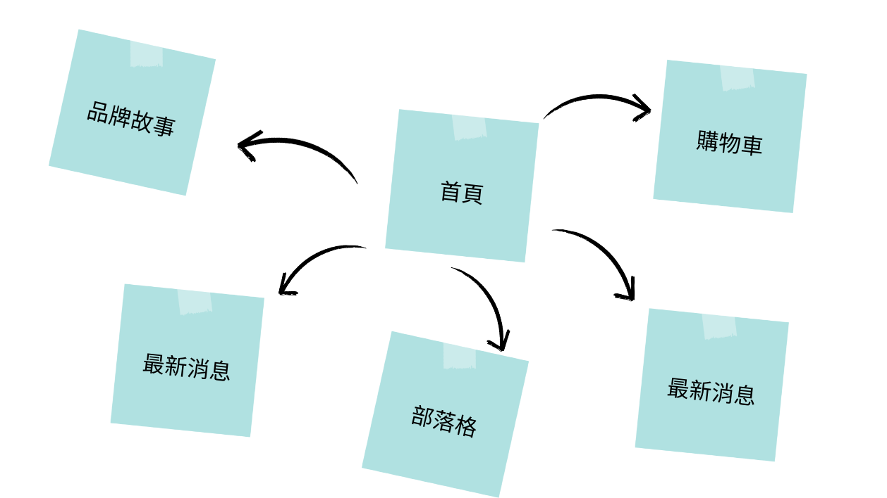{class="block mx-auto mt-4 rounded-lg shadow w-[55%]"}

<!--
不用一次想齊全，先抓首頁加 3-5 個主要頁面即可，後面隨時能增刪。
可請學員照自己的網站用途，說說會有哪些頁面。
-->

---

# 想想看網站英文名？

## 為了網域！什麼是網域（Domain）？

- 網域就是網站的**門牌地址**：`example.com`、`myname.tw`
- 沒有網域，訪客要記一串 IP 數字，沒人記得住
- 有自己的網域，代表**專業、好記，而且不被平台綁住**

<div class="flex items-center justify-center gap-6 mt-4">
  <figure class="text-center m-0">
    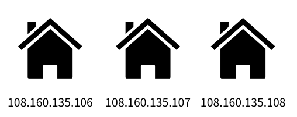
    <figcaption class="text-sm text-gray-400 mt-1">難記的 IP 位址</figcaption>
  </figure>
  <div class="text-3xl text-gray-400">→</div>
  <figure class="text-center m-0">
    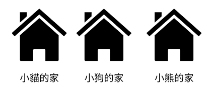
    <figcaption class="text-sm text-gray-400 mt-1">好記的網域名稱</figcaption>
  </figure>
</div>

<v-click>

網域是**用租的**，一年一年續；也是**先搶先贏**，全世界唯一，好名字要趁早。

</v-click>

<!--
比喻：網域是門牌，IP 是經緯度座標，人類記門牌、機器查座標。
常見問題：「網域是買斷的嗎？」不是，是年租制，記得續約（可設自動續約）。
-->

---

# 怎麼取一個好網域名稱？

<v-clicks>

- **簡短好記**：越短越好，避免連字號與容易拼錯的字
- **用英文或拼音**：中文網域支援度仍不佳
- **結尾（頂級域名）怎麼選**：
  - `.com`：最通用、最多人認得
  - `.tw` / `.com.tw`：台灣在地識別
  - `.org`、`.net`、`.blog`：依用途選擇
- **命名方向**：自己的名字、品牌名、主題＋名字

</v-clicks>

<!--
請學員現在就想 2-3 個候選名字，因為第一志願常常已被註冊。
個人品牌用自己的名字最保險；不要用公司或學校的正式名稱註冊個人網域，避免日後爭議。
-->

---

# 怎麼查網域有沒有被用過？

網域全世界唯一、先搶先贏，動手前先確認你想的名字還在不在：

<v-clicks>

- 到網域商（例如 **Gandi**）的搜尋框輸入名字，立刻顯示能不能註冊
- 或用 **WHOIS 查詢工具**，查得到註冊資料就代表已經被人用了
- 被搶先了怎麼辦？**換個結尾**（`.tw`、`.co`）或**微調名字**
- 建議多準備 **2-3 個候選**，第一志願常常已被註冊

</v-clicks>

<v-click>

實際購買流程，第 02 堂會由講師示範。

</v-click>

<!--
現場可以開 Gandi 搜尋框，輸入學員想到的名字即時示範查詢結果，互動效果好。
提醒：查到「可註冊」不等於免費，仍要年繳，購買在第 02 堂示範。
-->

---
layout: center
class: text-center
---

# 第 01 堂小結

WordPress = 全球最多人用的開源建站系統

動手前先想清楚：這個網站要做什麼、為它取一個好網域名稱

接下來，捲起袖子開始啟動你的網站！

<!--
第 01 堂以觀念與規劃為主。確認每位學員都想好網站用途與網域名稱方向，再進入第 02 堂實作。
-->

---
layout: section
---

# 第 02 堂
# 啟動 WordPress 網站


<!--
本日重頭戲。流程設計：伺服器、網域、DNS、SSL 由講師完整示範（學員看，回家可自己做）；
學員真正動手的是用講師開好的主機與子網域，透過 FTP 安裝 WordPress。
示範段節奏可快一點，把時間留給學員實作 FTP 安裝。
-->

---

# 2-1 什麼是伺服器

**伺服器（Server）＝ 一台 24 小時開機、連著網路的電腦**

<v-clicks>

- 你的網站檔案放在上面，全世界的人隨時都能來看
- 自己家裡的電腦不行嗎？要 24 小時開機、固定 IP、防駭客……太累了
- 所以我們**用租的**：跟專業機房租一台

</v-clicks>

<!--
常見問題：「網站放在我電腦裡不行嗎？」理論上可以，實務上不切實際（斷電、關機、資安）。
比喻：開店不會開在自己家客廳，會去租店面。
-->

---

# 主機的三種常見型態

| 型態 | 概念 | 適合 |
|------|------|------|
| **虛擬主機** | 跟很多人合租一間房 | 預算極低、流量小 |
| **雲端主機（VPS）** | 自己租一間套房 | 彈性大，但要自己管系統 |
| **託管式雲端主機** | 租套房＋有管家 |  我們的選擇 |

<v-click>

**Cloudways = 託管式**：主機在雲端大廠，系統更新、安全性、WordPress 安裝都有人幫你顧。

</v-click>

<!--
不用深入技術細節，重點是讓學員理解「為什麼不選最便宜的」：
老師的時間寶貴，託管式把系統管理的苦工外包掉，才能專心經營內容。
-->

---

# 為什麼選 Cloudways？

- **免管系統**：不用碰 Linux 指令，全部在網頁介面操作
- **一鍵安裝 WordPress**：建伺服器時直接選好
- **機房可選亞洲**：新加坡、東京，台灣連線速度快
- **月繳制**：用多少付多少，不滿意隨時停
- **長大了再升級**：流量變大時可直接調高方案

<v-click>

 今天**講師已用 Cloudways 開好主機**，並幫每位學員建好**子網域與資料庫**；接下來示範它怎麼來，再讓大家 FTP 安裝。

</v-click>

<!--
利益揭露：如果講師有推薦連結，這裡應明講。
有學員會問「為什麼不用 XX 主機？」回答：原理相同，學會一家就會舉一反三，課程選一家統一教學才有效率。
強調：學員今天不用自己註冊 Cloudways，用講師開好的主機即可，省去等待與綁卡的時間。
-->

---

# 認識三個服務

架一個正式網站會用到三個服務，各司其職：

| 角色 | 選用範例 | 說明 |
|------|------|------|
| 伺服器 | **Cloudways** | 放網站的地方，就像是房子 |
| 網域 | **Gandi** | 網站的名字，就像是門牌地址 |
| SSL 與 CDN | **Cloudflare** | 加密與加速，就像是保全 |

<v-click>

今天這三個由**講師示範**操作；學員會用**講師開好的主機與子網域**直接安裝 WordPress。

</v-click>

<!--
這個比喻整天都會用到，請講清楚：房子（伺服器）、門牌（網域）、保全（Cloudflare）。
重點轉達：今天學員不用自己註冊這三個服務，講師會示範完整流程，並提供開好的主機與子網域讓大家實作 FTP 安裝。
這三個服務的概念在自己回家架站、以及 Day 2、Day 3 都會再用到。
-->

---

# 整體架構：一個網址背後發生的事

當訪客在瀏覽器輸入你的網址……

```
 瀏覽器            DNS                 伺服器
 輸入網址     →    查出 IP 位址    →    Cloudways 主機
 example.tw        （像查電話簿）         │
                                        ▼
        ←←←←   把網頁傳回給訪客   ←←←←   WordPress 產生網頁
```

- **網域**：人類好記的名字（example.tw）
- **DNS**：把名字翻譯成機器位址（IP）
- **伺服器**：真正存放網站、產生網頁的電腦

<!--
這張圖是今天的「地圖」，第 02 堂每完成一步就回來對照一次。
不用要求學員現在完全懂，先有整體印象即可，做完操作後回頭看會恍然大悟。
-->

---
layout: two-cols
layoutClass: gap-6
---

# 2-2 開啟 WordPress 伺服器

**🛸 示範**　

## 第一步：註冊 Cloudways

1. 前往 Cloudways 官網，點選註冊／免費試用
2. 填寫 Email、姓名、密碼（**密碼記下來！**）
3. 到信箱收驗證信，點擊連結完成啟用
4. 可能會有簡短電話或身分驗證，依畫面指示完成

::right::

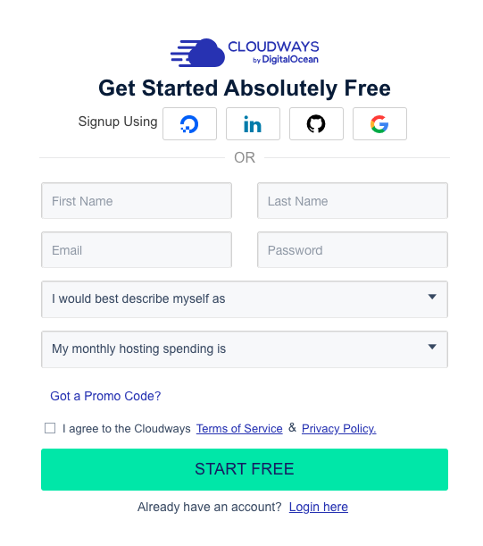{class="rounded-lg shadow max-h-[78vh] mx-auto"}

<!--
常見卡關：
1. 驗證信跑到垃圾郵件，請學員先檢查垃圾信件匣。
2. 學校 Email 擋信，改用 Gmail。
3. 部分帳號註冊後需要人工審核，若卡住請舉手，講師協助聯繫客服或使用備用方案。
-->

---

# 建立伺服器：要做哪些選擇？

按下「建立伺服器」之類的按鈕後，會看到幾個選項：

| 選項 | 我們選什麼 | 為什麼 |
|------|-----------|--------|
| 應用程式 | **WordPress**（最新版） | 系統會幫你裝好 |
| 雲端供應商 | 預設入門款即可 | 夠用就好 |
| 方案大小 | **最小方案** | 個人網站綽綽有餘 |
| 機房位置 | **新加坡或東京** | 離台灣近、速度快 |

<!--
介面選項名稱可能隨改版變動，教「找什麼」而不是「按哪裡」。
強調機房選錯（例如選到美國）網站會明顯變慢，但之後也能搬，不用恐慌。
-->

---
layout: two-cols
layoutClass: gap-6
---

# 建立伺服器：實際操作

1. 登入後點選**建立伺服器**的按鈕
2. 應用程式選 **WordPress**，並幫伺服器與應用程式取個名字（英文即可）
3. 方案選**最小規格**、機房選**新加坡或東京**
4. 確認後送出，**等待數分鐘**讓系統建置

::right::

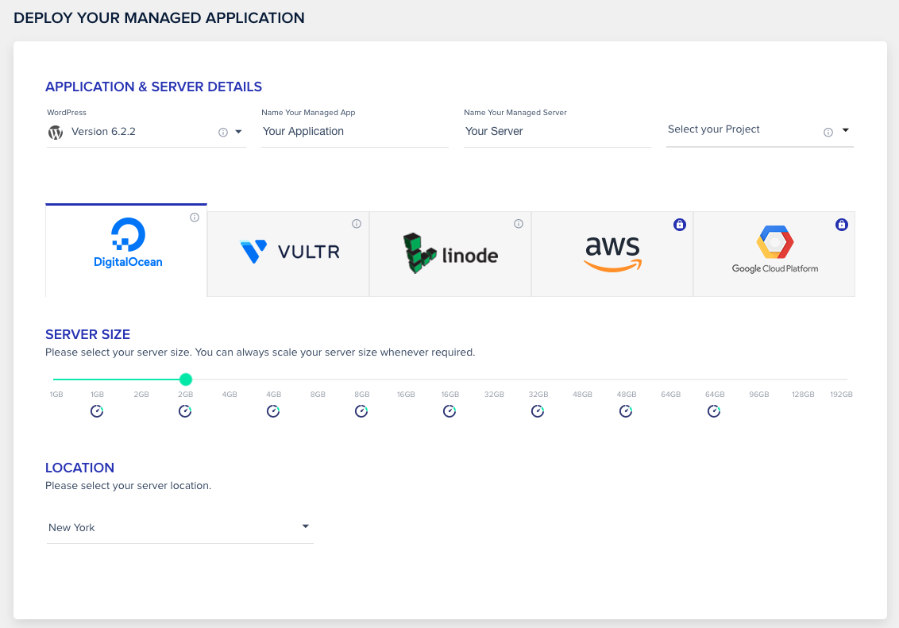{class="rounded-lg shadow w-full mt-12"}

<!--
建置要等 5-10 分鐘，正好利用這段時間預告下一節「網域」的概念，不要乾等。
命名建議用學員好辨識的英文，例如 mysite、classweb，避免中文。
-->

---

# 2-3 購買網域名稱

**🛸 示範**　

網域的「是什麼、為什麼、怎麼取名與查詢」第 01 堂已經談過，這裡示範**實際購買**。

## 第一步：註冊 Gandi 帳號

**重點與注意事項**

1. 前往 Gandi 官網（介面有繁體中文）
2. 點選註冊，填寫 Email 與密碼
3. 收驗證信完成啟用
4. 補齊個人資料（網域註冊規定需要真實聯絡資訊）

<!--
為什麼選 Gandi：有中文介面、價格透明、附贈信箱服務。
也可順帶提：GoDaddy、Namecheap 等都是同類服務，原理相同。
聯絡資訊要填真實的，這是國際網域註冊規範（WHOIS）要求。
-->

---

# 購買網域

**重點與注意事項**

1. 在 Gandi 搜尋框輸入你想要的名字，查看哪些結尾可註冊
2. 比較**首年價格與續約價格**（有些首年特價、續約變貴）
3. 加入購物車，選擇註冊年限（先買一年即可）
4. 用信用卡結帳，完成後可在帳號的網域列表看到它

<!--
常見卡關：
1. 想要的名字被註冊了，換結尾或微調名字，事先想好備案。
2. 信用卡刷不過，3D 驗證簡訊沒收到、額度問題，或改用鄰座協助。
3. 注意隱私保護（WHOIS 隱私）選項，Gandi 多半預設提供。
購買成功後先停在這裡，等大家都完成再進 DNS 設定。
-->

---

# 網域註冊後的兩個小設定 

買完網域，順手檢查這兩件事：

- **自動續約**：建議開啟，避免忘記續約、網域被別人搶走
- **WHOIS 隱私保護**：隱藏你的個人聯絡資訊，避免垃圾信騷擾
  （Gandi 多半預設提供）

<v-click>

 也把**到期日**記到你的行事曆，雙重保險。

</v-click>

<!--
這頁是「保險頁」，一分鐘帶過即可。
真實案例：忘記續約導致網域被搶註、經營多年的網址作廢，對老師的教學歷程網站是大損失。
-->

---

# 2-4 設定網域名稱

**🛸 示範**　買好網域後，要讓它指向伺服器：

- 一台伺服器（有 IP 位址）
- 一個網域（剛買的名字）
- 但它們**還不認識彼此**

<v-click>

接下來做兩件事：

1. 跟 **Cloudways** 說：「這個網域是我的」
2. 跟 **Gandi** 說：「這個網域指向我的伺服器 IP」

</v-click>

<!--
先把「兩邊都要設定」這個大局講清楚，學員才不會做完一邊就以為完成了。
這是今天第一個容易混亂的環節，放慢速度。
-->

---

# DNS 是什麼？ 電話簿比喻

- 你記得朋友的**名字**，手機通訊錄幫你查出**電話號碼**
- 同樣地：訪客記得你的**網域**，**DNS** 幫忙查出伺服器的 **IP**

```
 訪客輸入 myclass.tw
        ↓
 DNS：「myclass.tw 的 IP 是 203.0.113.10」
        ↓
 瀏覽器連到 203.0.113.10 → 看到你的網站
```

- 我們要做的，就是去 DNS「電話簿」裡**登記這一筆**：
  **A 紀錄**＝「這個名字 → 這個 IP」

<!--
「A 紀錄」的 A 是 Address。學員只需要記住：A 紀錄＝名字對 IP 的對照表。
這個比喻後面講「DNS 生效要等」時會再用到：電話簿改了，但大家手上的舊電話簿還沒換新。
-->

---

# 步驟一：在 Cloudways 設定網域

**重點與注意事項**

1. 進入 Cloudways 的**應用程式**頁面
2. 找到**網域管理（Domain Management）**的設定區
3. 輸入你剛買的網域，設為主要網域並儲存

<!--
常見卡關：學員把網域打錯字（少打字母、多打 www）。建議從 Gandi 帳號複製貼上。
此時網站還連不上新網域，這是正常的，DNS 那一半還沒設定，先預告以免學員慌張。
-->

---

# 步驟二：在 Gandi 設定 DNS A 紀錄

**重點與注意事項**

1. 登入 Gandi，進入你的網域 → **DNS 紀錄**設定頁
2. 找到（或新增）**A 紀錄**：
   - 名稱：`@`（代表網域本身）
   - 值：你的**伺服器 IP 位址**
3. 可再加一筆 `www` 的紀錄指向同一個地方
4. 儲存

<!--
最容易出錯的一頁：
1. IP 抄錯一個數字，請學員從 Cloudways 複製貼上。
2. Gandi 預設可能已有一些紀錄，要「修改」既有的 A 紀錄而不是重複新增。
3. `@` 符號的意義要解釋：代表「網域本身」（不加任何前綴）。
-->

---

# DNS 生效需要時間 

- 改了「電話簿」，**全世界的快取**要陸續更新
- 通常**幾分鐘到幾小時**，偶爾更久，這是正常的！
- 怎麼確認生效？直接在瀏覽器輸入網域試試看

<v-click>

 **這就是為什麼今天用講師開好的子網域**：DNS 生效要等，現場乾等太浪費時間。

</v-click>

<!--
這頁解釋「DNS 要等」的特性，也順勢說明今天為何不讓學員各自接網域，等待太花時間。
進階學員可介紹用線上 DNS 查詢工具確認，但非必要。
-->

---
layout: center
---

# 示範成果：門牌掛上了

DNS 生效後，在瀏覽器輸入**網域**就會看到 WordPress 首頁

<div class="text-left max-w-md mx-auto mt-6">

 **網域 → 伺服器，門牌掛好了！**

 但此時瀏覽器可能顯示「不安全」因為還沒設定 SSL，下一節就來處理。

</div>

<!--
這是講師示範的成果，學員不用自己操作（你們的網站已經在講師開好的子網域上）。
重點讓學員理解：網域連上後若沒 SSL 會顯示「不安全」，這就引出下一節 Cloudflare。
-->

---

# 2-5 設定 Cloudflare（SSL 與 CDN）

**🛸 示範**　

## 什麼是 SSL／HTTPS？

- **SSL**：瀏覽器和伺服器之間的**加密通道**
- 有了它，網址從 `http://` 變成 `https://`，瀏覽器顯示**鎖頭**
- 沒有它：
  - 瀏覽器警告「**不安全**」，訪客會被嚇跑
  - 傳輸內容可能被竊聽（例如登入密碼）
  - 搜尋引擎排名也會吃虧

<!--
讓學員打開任何一個大網站，看網址列的鎖頭圖示，建立具體印象。
重點訊息：現代網站 HTTPS 是標配，不是選配。
-->

---

# 什麼是 CDN？

**CDN（內容傳遞網路）＝ 在世界各地放「轉運倉庫」**

- 沒有 CDN：所有訪客都跑到你的伺服器（例如新加坡）拿資料
- 有 CDN：訪客從**離他最近的節點**拿資料 → 更快
- 順便擋掉惡意流量 → 更安全

<div class="flex justify-center gap-6 mt-3">
  <figure class="m-0 w-[46%] text-center">
    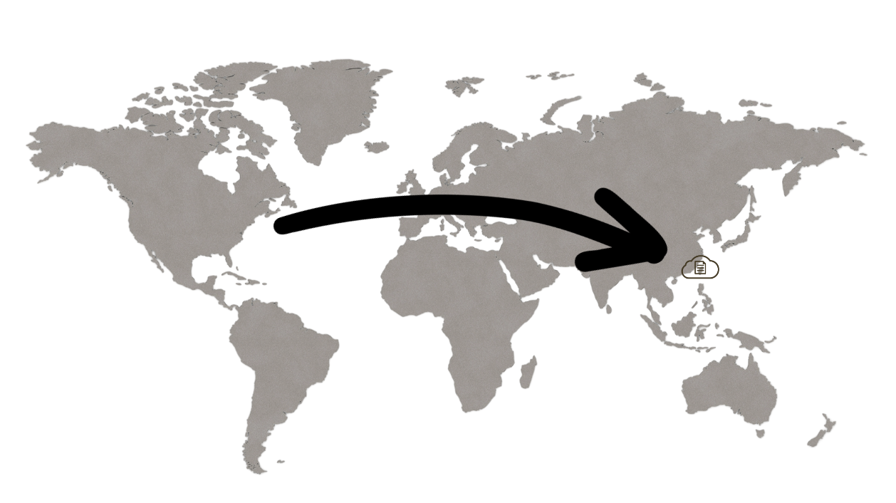
    <figcaption class="text-sm text-gray-400 mt-1">沒有 CDN：都連到單一伺服器</figcaption>
  </figure>
  <figure class="m-0 w-[46%] text-center">
    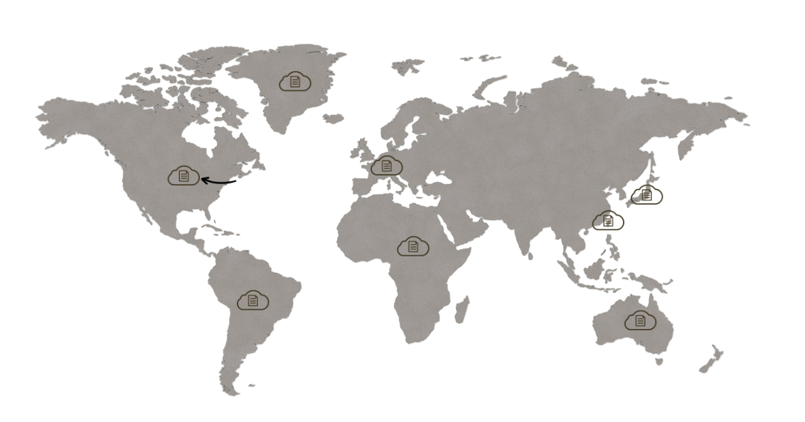
    <figcaption class="text-sm text-gray-400 mt-1">有 CDN：就近節點取得</figcaption>
  </figure>
</div>

<v-click>

**Cloudflare** 同時提供 **免費的 CDN ＋ 免費的 SSL**，一石二鳥，所以我們用它。

</v-click>

<!--
比喻：網購從本地倉庫出貨 vs 從國外倉庫寄來。
學員不需要深究 CDN 原理，記住「Cloudflare = 免費讓網站更快更安全」即可。
-->

---

# 步驟 1：註冊 Cloudflare 並加入網站

 目前位置：**Cloudflare**

**重點與注意事項**

1. 前往 Cloudflare 官網註冊（Email ＋ 密碼）
2. 點選**新增網站**，輸入你的網域
3. 方案選擇 **Free（免費）** 即可
4. Cloudflare 會自動掃描你現有的 DNS 紀錄，確認 A 紀錄有被帶進來


<!--
常見卡關：
1. 方案頁面把付費方案放很顯眼，免費方案在下面，提醒學員找 Free。
2. 自動掃描通常會帶入剛剛設的 A 紀錄，請學員核對 IP 是否正確。
-->

---

# 步驟 2：在 Gandi 更換名稱伺服器

 目前位置：**Gandi**

**重點與注意事項**

1. Cloudflare 會給你**兩個名稱伺服器位址**（類似 `xxx.ns.cloudflare.com`）
2. 回到 Gandi → 你的網域 → **名稱伺服器（Nameservers）**設定
3. 從 Gandi 預設改為**外部名稱伺服器**，貼上 Cloudflare 給的兩個位址
4. 儲存


<!--
概念解釋：原本「電話簿」由 Gandi 管，現在整本電話簿交給 Cloudflare 管，它才能幫我們加上 SSL/CDN。
常見卡關：兩個位址要完整複製貼上，手打必錯。
這一步生效也需要時間（幾分鐘到幾小時）。
-->

---

# 步驟 3：等待 Cloudflare 接管完成

 目前位置：**Cloudflare**

- 回到 Cloudflare 控制台，等待網站狀態變成**有效（Active）**
- 可以點「重新檢查」按鈕加速確認
- 等待期間，我們先把 SSL 模式設定好（下一步）


<!--
等待時間不定，從幾分鐘到數小時。課程設計上：先設定好 SSL 模式，沒生效的學員可先繼續往後上課，課程空檔再回來檢查。
講師可準備一個已生效的帳號示範後續步驟，避免全班卡在等待。
-->

---

# 步驟 4：設定 SSL 為 Full 模式

 目前位置：**Cloudflare**

**重點與注意事項**

1. 進入你的網站 → **SSL/TLS** 設定區
2. 加密模式選擇 **Full（完整）**
3. 為什麼是 Full？訪客到 Cloudflare、Cloudflare 到伺服器**全程加密**

<!--
常見卡關：模式選錯。
- Flexible 模式可能造成 WordPress 無限重新導向（轉圈圈打不開），這是日後最常見的災難之一。
- 請學員確認選的是 Full。若官網介面提供 Full (Strict)，搭配 Cloudways 的憑證也可以，依現場狀況指導。
-->


---
layout: center
---

# 示範成果：正式規格的網站

用 `https://網域` 打開，看到  **鎖頭** = 一個「正式規格」的網站

<div class="text-left max-w-md mx-auto mt-6">

- 自己的網域
- 加密連線（HTTPS）
- 全球加速（CDN）


</div>

<!--
這是講師示範的最終成果，讓學員看到「自己架站」最後長什麼樣子。
強調學員今天的網站（子網域上的 WordPress）已經能用，網域/SSL 是回家自己做的進階知識。
-->

---

# 2-6 設定 SMTP：讓網站會寄信

**🛸 示範**　

## 為什麼網站需要寄信？

- **忘記密碼**：重設密碼信寄不出去，就進不了後台
- **表單通知**：報名表、聯絡表單，有人填寫要通知你
- **系統通知**：更新、安全提醒

<v-click>

伺服器**預設不會寄信** → 我們透過 **SMTP** 借專業郵件服務的手來寄。

</v-click>

<!--
SMTP 全名不用背，比喻：網站自己寄信像「沒貼郵票亂投遞」，會被當垃圾信；
SMTP 是「正式去郵局交寄」，對方才收得到。
這節若時間不足可以示範為主，學員回家照講義操作，不影響今天主線。
-->

---

# SMTP 設定步驟重點

**重點與注意事項**

1. 選一個寄信服務：這裡改用 resend 作為示範
2. 取得 SMTP 連線資訊：**主機、連接埠、帳號、密碼**
3. 在 Cloudways 或 WordPress 外掛中填入這些資訊
4. **寄一封測試信**給自己，收到才算完成


---

# 實作：用 FTP 上傳 WordPress 核心

**換你動手了！** 你會拿到三樣東西：

- **你的專屬子網域**（例如 `你的代號.ericwu.asia`）
- **FTP 連線帳密**（主機、帳號、密碼）
- **資料庫帳密**（DB 名稱、帳號、密碼）

<v-click>

接下來四步：**下載 WordPress → 安裝 FileZilla → FTP 上傳 → 跑安裝精靈**

</v-click>

<!--
這是學員今天真正動手的核心環節，請放慢、確認每位都拿到三組資訊再開始。
先把四步驟的全景講一次，學員才知道自己在哪一步。
-->

---

# 步驟 1：下載 WordPress

**重點與注意事項**

1. 前往 **tw.wordpress.org**（正體中文官網）點「**取得 WordPress**」
2. 下載最新版的壓縮檔（`.zip`）
3. **解壓縮**，會得到一個 `wordpress` 資料夾
4. 先別關，待會要把裡面的檔案上傳

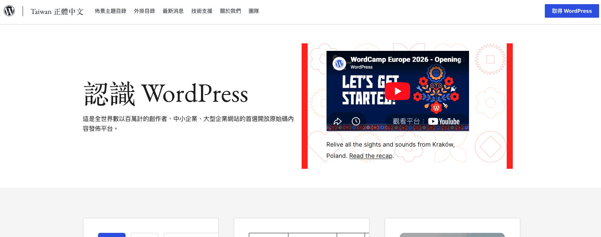{class="block mx-auto mt-3 rounded-lg shadow w-[80%]"}

<!--
提醒一定要從官方 wordpress.org 下載，不要從來路不明的網站，避免被植入後門。
解壓縮後讓學員打開資料夾看看裡面有 wp-admin、wp-content、wp-includes 等，建立印象。
-->

---

# 步驟 2：安裝 FileZilla 並連線

**重點與注意事項**

1. 前往 **filezilla-project.org**，下載 **FileZilla Client**（不是 Server）
2. 安裝後開啟，用**拿到的連線資訊**填入上方欄位：
   - **主機（Host）**、**使用者（Username）**、**密碼（Password）**、**連接埠**（通常 21 或 22）
3. 點「**快速連線**」，左半邊是你的電腦、右半邊是主機

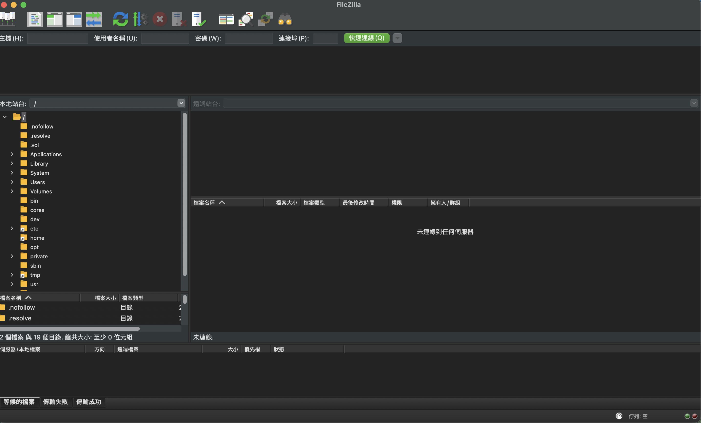{class="block mx-auto mt-3 rounded-lg shadow w-[72%]"}

<!--
常見卡關：
1. 下載到 FileZilla Server，強調要抓 Client。
2. 連不上，多半是主機/帳號/密碼貼錯，或埠號不對，請從拿到的資訊複製貼上。
3. 出現憑證信任視窗，按「確定／信任」即可。
-->

---

# 步驟 3：用 FTP 上傳 WordPress

**重點與注意事項**

1. 在 FileZilla **右半邊（主機）**進入你子網域對應的資料夾
2. 在**左半邊（你的電腦）**打開解壓縮的 `wordpress` 資料夾
3. 把 `wordpress` 資料夾**「裡面的所有檔案」**拖到右邊
   （是裡面的內容，**不是整個 wordpress 資料夾**）
4. 等待上傳完成（檔案很多，需要幾分鐘）


<!--
最容易出錯的一步：把整個 wordpress 資料夾傳上去，導致網址要多打一層 /wordpress。
請示範「進到資料夾裡、全選、往右拖」。
上傳要等幾分鐘，可利用這段時間預告下一步安裝精靈會用到資料庫帳密。
-->

---

# 步驟 4：跑 WordPress 安裝精靈

**重點與注意事項**

1. 瀏覽器打開**你的子網域**，會看到 WordPress 安裝畫面 → 選語言
2. 填入**拿到的資料庫資訊**：DB 名稱、帳號、密碼、主機
3. 設定**網站標題**，以及你的**管理員帳號與密碼（務必記下來！）**
4. 按下安裝，完成後就能登入後台

<!--
常見卡關：
1. 資料庫連線錯誤，帳密或主機填錯，請從拿到的資訊複製貼上。
2. 找不到安裝畫面，確認上傳的是「裡面的檔案」而非整個資料夾，網址不用加 /wordpress。
3. 管理員密碼一定要記下來，等一下登入後台、Day 2/3 都要用。
-->

---
layout: center
---

# 進度檢查站 1

打開**你的子網域**，再到 `你的子網域/wp-admin` 登入

<div class="text-left max-w-md mx-auto mt-6">

看到 WordPress 首頁、能登入後台 = **你親手裝好 WordPress 了！**

你的網站正式上線，今天的實作大功告成！

</div>

<!--
全班對齊進度的時刻，請每位學員都確認子網域打得開、後台登得進去。
卡關的學員：多半是上傳成整個資料夾、或資料庫帳密填錯，逐一協助。
先完成的學員可先逛逛後台，或當小助教。
-->

---

# 第 02 堂回顧：完整架構長這樣

```
    Cloudflare（SSL + CDN）       講師示範
        │ 名稱伺服器接管、Full 模式加密
        ▼
    Gandi（網域）                  講師示範
        │ A 紀錄 → 指向伺服器 IP
        ▼
    Cloudways（伺服器）            講師示範
        │ 講師開好主機與子網域
        ▼
    WordPress（你的網站）          你 FTP 安裝
```

**每一層各司其職：保全 → 門牌 → 房子 → 內容。**

<!--
對照第 01 堂的架構圖：上面三層（保全/門牌/房子）今天由講師示範，回家自己架站時就是照這個流程做；
最底層「內容」WordPress 是學員今天親手用 FTP 裝起來的。
請學員試著用自己的話說一遍這四層，能說出來才是真的懂。
-->

---

# 常見卡關排查：FTP 安裝 WordPress

**今天最可能遇到的狀況**，依序檢查：

1.  **FileZilla 連不上**，主機/帳號/密碼/埠號貼錯，從講師發的資訊重新複製
2.  **子網域打開沒看到安裝畫面**，多半是上傳成「整個 wordpress 資料夾」，應該傳「裡面的檔案」
3.  **資料庫連線錯誤**，安裝精靈的 DB 名稱/帳號/密碼/主機填錯，重新核對
4.  **上傳很慢或中斷**，檔案多屬正常，斷了就讓 FileZilla 重新傳剩下的


<!--
這是今天學員實作最可能卡關的地方，請講師與助教重點巡這四項。
最常見：上傳成整個資料夾（網址要多一層 /wordpress）、以及 DB 帳密填錯。
-->

---

# 第 02 堂完成！

你已經完成今天**技術含量最高**的部分

接下來輕鬆一點：進去 WordPress 裡面玩

<!--
給學員大大的肯定，很多工程師第一次架站也會卡在 DNS 和 SSL。
休息 10 分鐘，回來進入 WordPress 後台操作。
-->

---
layout: section
---

# 第 03 堂
# 認識 WordPress

進入後台・基本設定・第一篇文章・第一個頁面

<!--
這一堂操作難度低、成就感高，節奏可以加快。
重點是讓學員在下課前「發佈出真正的內容」。
-->

---

# 3-1 進入後台

**WordPress 網站 = 前台 + 後台**

- **前台**：訪客看到的網站（你的子網域）
- **後台**：只有你能進的管理區

<v-click>

後台入口：

```
https://你的子網域/wp-admin
```

帳號密碼：**剛剛 FTP 安裝精靈時你自己設定的那組！**

</v-click>

<!--
比喻：前台是店面，後台是辦公室兼倉庫。
忘記帳密的學員：就是安裝精靈步驟 4 自己設的管理員帳密，請回想或舉手協助。
請學員把 /wp-admin 這個網址加入書籤。
-->

---
layout: two-cols
layoutClass: gap-6
---

# 登入後台

1. 瀏覽器輸入 `https://你的子網域/wp-admin`
2. 輸入**安裝時自己設定**的管理員帳號與密碼
3. 登入成功會看到**控制台（Dashboard）**

::right::

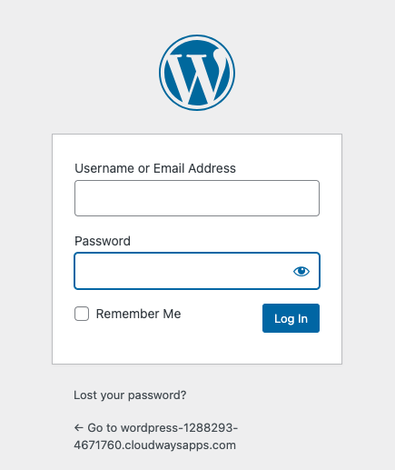{class="rounded-lg shadow max-h-[70vh] mx-auto"}

<!--
常見卡關：
1. 帳密複製時前後多了空格，請重新仔細複製。
2. 進到的是英文介面，正常，下一步就來改語言。
提醒：管理員密碼之後可以在「使用者」裡改成自己好記的。
-->

---

# 3-2 更換語言與時區

**重點與注意事項**

1. 左側選單 **Settings → General**
2. **Site Language** 改為「繁體中文」→ 儲存後整個後台變中文
3. **時區（Timezone）** 選 **台北（UTC+8）**，排程發文時間才會正確
4. 順便確認**網站標題**與**網站說明**，改成你自己的


<!--
改完語言記得按儲存，頁面重新載入後才會變中文。
時區常被忽略，但會影響文章顯示時間和預約發佈，務必改。
網站標題現場就讓學員想一個，例如「王老師的數學教室」。
-->

---

# 3-3 認識後台：控制台導覽

左側選單就是你的工具箱：

| 選單 | 用途 |
|------|------|
|  **文章** | 部落格內容，按時間排列 |
|  **媒體** | 所有上傳的圖片、檔案 |
|  **頁面** | 固定資訊頁（關於我、聯絡方式） |
|  **外觀** | 佈景主題、網站長相（**第 04 堂主角**） |
|  **外掛** | 擴充功能（Day 2 主角） |
|  **設定** | 網站的各種開關 |

<!--
不用每一項都點開講，先建立「地圖」。
告訴學員：第 03 堂會用到「文章」「頁面」「設定」，「外觀（佈景主題）」是等一下第 04 堂的重頭戲，「外掛」則是 Day 2，留個伏筆。
-->

---

# 後台導覽：實際看一圈

**跟著我把每個選單點開看一眼**（不用記住細節）

- 文章 → 有一篇預設的「網站第一篇文章」
- 頁面 → 有預設的範例頁面
- 媒體 → 現在是空的
- 使用者 → 你自己（管理員）

<!--
帶逛的目的是降低陌生感，讓學員敢自己亂點。
強調：後台亂點不會弄壞網站，最多把那篇文章刪掉重來，放心探索。
預設的範例文章和頁面可以之後刪除。
-->

---

# 3-4 第一篇文章：區塊編輯器

WordPress 的編輯器叫 **Gutenberg（區塊編輯器）**

- **一切都是區塊**：一段文字是區塊、一張圖是區塊、一個清單也是區塊
- 按 **「+」** 新增區塊，選你要的類型
- 區塊可以**上下搬移、隨時調整**
- 像玩樂高：把內容一塊一塊疊出來

<!--
有用過 Notion 或 Canva 的學員會覺得很熟悉，可以這樣類比。
用過舊版 WordPress 的學員可能不習慣，請他們給區塊編輯器一個機會。
-->

---

# 動手寫第一篇文章

**重點與注意事項**

1. 左側選單 **文章 → 新增文章**
2. 輸入**標題**（例如：我的第一篇文章）
3. 按 **「+」** 試著加入這些區塊：
   - **段落**：打一段文字
   - **標題**：幫文章分段落小標
   - **圖片**：上傳一張照片
   - **清單**：列幾個重點

<!--
給學員 10 分鐘自由打字、玩區塊。
常見卡關：找不到「+」按鈕，左上角和段落之間都有；或直接打「/」喚出區塊選單（進階）。
圖片版權提醒：教學示範可先用自己拍的照片。
-->

---

# 發佈！

**重點與注意事項**

1. 右上角點選**發佈**按鈕（會再確認一次）
2. 發佈成功後，點**檢視文章**到前台看成果
3. 想修改？回後台 → 文章列表 → 點文章標題即可再編輯
4. 還沒寫完？用**儲存草稿**，之後再繼續


<v-click>

 **這一刻，你的內容正式對全世界公開了。**

</v-click>

<!--
儀式感時刻：請學員發佈後把自己的文章網址貼到課程群組，大家互相看。
常見問題：「發佈了可以改嗎？」隨時可以改、可以撤回成草稿，不用有壓力。
-->

---

# 幫文章整理櫃子：分類與標籤

文章多了之後，需要整理：

- **分類（Category）**：大抽屜，一篇文章通常屬於一個
  例：教學筆記、班級活動、公告
- **標籤（Tag）**：小貼紙，一篇可以貼很多個
  例：段考、校外教學、108 課綱

<!--
今天先知道概念即可，文章還少，等內容累積後再認真規劃分類。
常見問題：「分類和標籤一定要設嗎？」不設也能發佈，WordPress 會自動歸入「未分類」。
-->

---

# 3-5 文章 vs 頁面：差在哪？

| |  文章（Post） |  頁面（Page） |
|---|---|---|
| 性質 | **時間流**的內容 | **固定**的資訊 |
| 例子 | 教學週記、活動紀錄、心得 | 關於我、課程介紹、聯絡方式 |
| 排列 | 新的在上面，會被洗下去 | 不會，掛在選單上隨時找得到 |
| 分類標籤 | 有 | 沒有 |

<v-click>

 **判斷口訣**：會一直新增的用「文章」，放著不太動的用「頁面」。

</v-click>

<!--
這是 WordPress 新手最重要的觀念之一，值得多花一分鐘。
類比：文章像 FB 貼文（一直發），頁面像 FB 的「關於」（很少改）。
-->

---

# 建立「關於我」頁面

**重點與注意事項**

1. 左側選單 **頁面 → 新增頁面**
2. 標題：「關於我」（或「關於本站」）
3. 內容建議：你是誰、教什麼科目、這個網站要放什麼、怎麼聯絡你
4. 一樣用區塊編輯，完成後**發佈**


<!--
編輯介面跟文章幾乎一樣，學員會發現很快上手，這就是區塊編輯器的好處。
提醒：聯絡方式不要放個人手機，放 Email 或學校公開信箱即可（順便機會教育個資觀念）。
-->

---

# 3-6 網站的頁首和頁尾

- **頁首（Header）**：網站最上方，網站標題、選單
- **頁尾（Footer）**：網站最下方，版權宣告、附加資訊
- 新版 WordPress 用**網站編輯器**（外觀 → 編輯器）直接視覺化編輯
- 一樣是**區塊**的概念：頁首頁尾也是用區塊拼出來的

<!--
網站編輯器（Site Editor）僅在區塊佈景主題下可用，預設佈景主題支援。
先講概念即可，Day 2 換佈景主題時會深入。
提醒學員：網站編輯器改的是「整個網站的外框」，文章/頁面編輯的是「內容」。
-->

---

# 把「關於我」加進選單

**重點與注意事項**

1. 進入**外觀 → 編輯器**，點選頁首區域
2. 找到**導覽選單**區塊
3. 把剛建立的**「關於我」頁面**加入選單
4. 儲存，回前台確認選單出現了


<!--
常見卡關：
1. 網站編輯器的儲存按鈕位置和文章編輯器不同，注意右上角。
2. 改完前台沒變，重新整理頁面，或可能是瀏覽器快取。
這一步做完，網站就有「真的網站的樣子」了：有選單、有頁面。
-->

---
layout: center
---

# 實作時間（20 分鐘）

請完成兩件事：

<div class="text-left max-w-lg mx-auto mt-6">

1.  **發佈一篇自我介紹文章**
   至少包含：一個標題區塊、兩個段落、一張圖片
2.  **建立並發佈「關於我」頁面**，加入頁首選單

</div>
<!--
實作時間講師和助教巡場，優先處理前面 FTP 安裝落後的學員。
提早完成的學員可以：多寫一篇文章、研究其他區塊類型、或當小助教。
結束前留 3 分鐘，挑 2-3 個學員網站投影分享。
-->

---
layout: center
class: text-center
---

# 第 03 堂小結

**後台**是你的工作室，**區塊**是你的積木

文章記錄時間流，頁面承載固定資訊

你已經是能獨立發佈內容的網站主人了 

<!--
快速收束第 03 堂，接著進入第 04 堂：佈景主題。
-->

---
layout: section
---

# 第 04 堂
# 佈景主題

讓網站換上專業的外衣

<!--
這一堂讓網站「變好看」，操作簡單、成就感高。
重點：學會挑選安全的佈景主題、安裝啟用，並用網站編輯器做基本客製。
-->

---

# 4-1 佈景主題安裝與啟用

把網站想成一個人：

- **內容**（文章、頁面、圖片）＝ 這個人本身
- **佈景主題** ＝ 他身上穿的**衣服**
- 換衣服不會換掉這個人——換主題**不會弄丟內容**

<v-click>

- 一鍵改變整體**配色、字體、版面排列**
- 你的**內容（文章、頁面）不會變**，只換外觀
- 不滿意隨時換一套，像幫網站換衣服一樣
- WordPress 有**數千種**免費與付費主題可選

</v-click>

<!--
比喻：同一個人（內容）可以換不同衣服（主題）；換主題不會刪掉你的文章。
鼓勵學員放心嘗試，換主題是可逆的。
-->

---

# 區塊主題 vs 傳統主題

| |  區塊主題 |  傳統主題 |
|---|---|---|
| 編輯方式 | **網站編輯器**視覺化拖拉 | 「客製化」介面＋小工具 |
| 頁首頁尾 | 可直接用區塊編輯 | 較受限 |
| 新版預設 |  是 | 舊主題仍常見 |

<v-click>

 **今天我們用「區塊主題」**，和第 03 堂的區塊編輯器一脈相承，最直覺。

</v-click>

<!--
不用深入技術細節，學員只要知道「優先選區塊主題」即可。
新版 WordPress 預設主題（Twenty Twenty-X 系列）都是區塊主題。
-->


---
layout: two-cols
layoutClass: gap-6
---

# 安裝並啟用佈景主題

1. 左側選單 **外觀 → 佈景主題 → 新增佈景主題**
2. 搜尋或瀏覽，滑鼠移上去可**即時預覽**
3. 選好後點 **安裝**，再點 **啟用**
4. 回前台重新整理，看看煥然一新的網站！

::right::

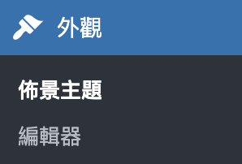{class="rounded-lg shadow w-[70%] mt-12"}

<!--
給學員幾分鐘自由挑主題、安裝啟用，現場會很熱鬧。
提醒：啟用後內容都還在，只是排版變了，放心換。
常見問題：「裝了好幾個會怎樣？」只有「啟用」的那個生效，其他放著不影響。
-->

---

# 用網站編輯器做基本客製

**重點與注意事項**

1. 進入 **外觀 → 編輯器**（區塊主題才有）
2. 可以調整：**網站標題／Logo、配色、字體、頁首頁尾**
3. 用區塊的方式編輯，改完按右上角**儲存**
4. 回前台確認效果


<!--
時間有限的話，這頁可由講師示範為主，學員回家再細調。
強調：網站編輯器改的是「整個網站的外框」，文章/頁面改的是「內容」，兩者不同。
改壞了可以用「樣式 → 重設」回到主題預設。
-->


---

# 4-2 如何挑選佈景主題

<v-clicks>

- **從官方目錄安裝**：外觀 → 佈景主題 → 新增（來源安全）
- **看評分與安裝數**：越多人用、評分越高越穩
- **看最後更新日期**：太久沒更新的別選（可能有漏洞）
- **要響應式**：手機、平板上也要好看
- **絕不裝破解主題**：來路不明的免費版常藏惡意程式

</v-clicks>

<v-click>

<div class="mt-6 p-4 bg-blue-50 dark:bg-blue-900 rounded-lg">
📱 <b>檢查法</b>：把瀏覽器視窗縮窄，或直接用手機打開網站，看版面會不會跑掉。
</div>

</v-click>

<!--
安全守則是重點，尤其「不要裝破解主題」這是學員回家最容易踩的雷。
官方目錄的主題都經過審核，最安全。
-->


---

# 免費 vs 付費主題

| | 免費主題 | 付費主題 |
|---|---|---|
| 取得 | 後台直接搜尋安裝 | 官網購買後上傳 |
| 功能 | 基本夠用 | 通常更多版型與客製選項 |
| 支援 | 社群論壇 | 官方客服 |
| 適合 | 入門、校園網站 | 有特殊需求時再考慮 |

<div class="mt-4 p-4 bg-green-50 dark:bg-green-900 rounded-lg">
✅ 本工作坊：<b>免費版即可</b>。付費主題的功能與價格以各官網為準。
</div>

<!--
提醒：不要去來路不明的網站下載「破解版」付費主題，常被植入惡意程式——這會呼應下午的資安小節。
-->

---

# 🛠 實作：挑選並啟用你的主題

<div class="text-lg">

**任務（15 分鐘）**

1. 到「外觀 → 佈景主題 → 安裝佈景主題」
2. 用關鍵字搜尋，挑 2–3 個候選
3. 用「即時預覽」比較
4. **啟用**一個你最喜歡的
5. 用手機打開自己的網站，檢查手機版

</div>

<div class="mt-4 p-3 bg-yellow-50 dark:bg-yellow-900 rounded-lg">
完成的學員：試試「外觀 → 自訂」改網站標題顏色或首頁設定。
</div>

<!--
巡場重點：
1. 有人會安裝了沒啟用，前台沒變 → 回去按「啟用」。
2. 有人啟用後首頁變空白 → 部分主題需要在「自訂」裡設定首頁，協助處理或先換回預設主題。
實作結束後口頭小結：主題＝衣服、安裝≠啟用、挑選五指標。接著休息 10 分鐘，下一堂是今天的重頭戲。
-->


---
layout: center
class: text-center
---

# 第 04 堂小結

挑一個**安全的區塊主題**，一鍵換上專業外觀

內容不變、外觀隨時換，你的網站，你作主 

<!--
快速收束第 04 堂，接著進入 Day 1 收尾。
-->

---
layout: section
---

# Day 1 收尾

檢查成果・回顧・預告明天

<!--
收尾控制在 15 分鐘內，重點是確認每個人都通過 Checkpoint。
-->

---

# Day 1 Checkpoint 

離開教室前，請確認：

- **WordPress 裝好了**：子網域打得開、能登入後台
- **發佈了第一篇文章**：前台看得到
- **發佈了一個頁面**：「關於我」掛在選單上
- **換上佈景主題**：網站有了新外觀
- **記住帳密**：子網域、後台管理員帳號密碼

<v-click>

 有任何一項沒打勾的請務必舉手，我們今天一起處理完再走。

</v-click>

<!--
FTP 安裝沒完成的學員：留下來協助，務必讓每位都能登入自己的後台。
提醒大家把「子網域網址」和「後台帳密」收好，明天 Day 2 會直接用。
明天上課第一件事就是重新檢查這份清單。
-->

---

# 今日回顧：四句話帶走

<v-clicks>

1. **第 01 堂**：WordPress 是全球最多人用的開源建站系統，自己的網站、自己作主。

2. **第 02 堂**：保全→門牌→房子→內容；你親手用 **FTP** 把 WordPress 裝進講師開好的主機。

3. **第 03 堂**：會一直新增的內容用「文章」，固定資訊用「頁面」，全部都用區塊拼出來。

4. **第 04 堂**：挑一個安全的**區塊佈景主題**，一鍵幫網站換上專業外觀。

</v-clicks>

<!--
可以反過來請學員說：「今天印象最深的一件事？」用 1-2 位學員的回答收尾，比講師自己念更有效。
-->

---

# 預告 Day 2：用外掛讓網站變強大 

明天你會學到：

- **外掛是什麼**：幫網站加功能的「App」
- **常用外掛**：表單、相簿、SEO、防垃圾留言……要什麼裝什麼
- 挑選外掛的**安全守則**（不踩雷）

<v-click>

 **今晚小作業**：想一想你的網站還想要什麼功能？列 2-3 個。

</v-click>

<!--
小作業很重要：明天裝外掛時，有明確需求的學員學得更有方向。
也提醒：今天的「子網域網址」與「WordPress 後台帳密」保管好，明天會直接用。
-->

---
layout: center
class: text-center
---

# Q&A

有任何問題，現在就問 

<!--
常見問題準備：
1. 「伺服器月費可以停嗎？」可以，但網站會跟著下線；網域記得續約。
2. 「可以架第二個網站嗎？」可以，同一台伺服器能裝多個應用程式。
3. 「手機可以管理網站嗎？」可以，後台支援手機瀏覽器，也有官方 App。
4. 「學生可以一起編輯嗎？」可以，WordPress 有多使用者角色，Day 3 會提到。
-->

---
layout: center
class: text-center
---

# 謝謝大家！明天見 

**Day 2：外掛功能擴充**

講師：Eric Wu

 Facebook：fb.me/eric0324　｜　 ericwu.asia

<!--
提醒三件事再放人：
1. Checkpoint 沒完成的留下來。
2. 子網域網址與後台帳密保管好，明天要用。
3. 今晚小作業：想想還想要哪些網站功能。
-->
