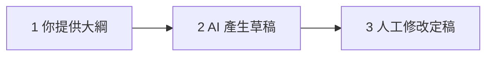
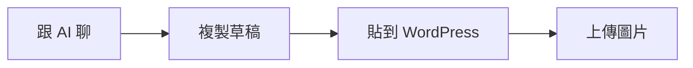
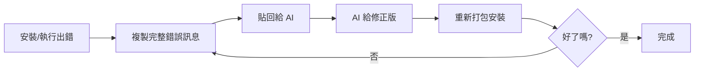

# WordPress 工作坊

## Day 3

教學 4.0：用 AI 打造自動化數位職人官網

講師：Eric Wu

2026 年 8 月 5 日

<!--
開場提醒：請學員先打開自己的網站後台登入，今天下午會大量實作。
確認大家 Day 2 的網站都還活著 (能登入、能發文)。
-->

---

# Day 1, 2 快速回顧：我們已經有一個完整的網站了

- **Day 1**：自架 WordPress、自有網域、HTTPS 上線
- **Day 1**：佈景主題挑選與基本版面設定

- **Day 2**：表單 (聯絡我們)、SEO (Yoast)、資安強化
- **Day 2**：備份 (UpdraftPlus)、Elementor 頁面編輯
- **Day 2**：WooCommerce 商店、Sensei LMS 線上課程

> 換句話說：**技術建置已完成**，接下來的問題是……
> 「這個網站，三個月後還會活著嗎？」

<!--
快速點名 Day 1-2 的成果，讓學員有成就感。
可以請一兩位學員秀一下自己的網站首頁。
順勢丟出「三個月後還活著嗎」這個問題，帶入今天主題。
-->

---

# 今日課表

| 時間 | 內容 |
|------|------|
| 08:00 – 10:00 | AI 協助內容經營、Royal MCP (AI 連接示範) |
| 10:00 – 12:00 | AI 客製化 WordPress 外掛 |
| 12:00 – 13:00 | 午餐 |
| 13:00 – 15:00 | 內容經營心法、視覺素材、SEO、NFC 導流卡片 |
| 15:00 – 17:00 | 網站成果分享 |

<!--
強調上午是「做中學」：用 AI 協助寫文章、生圖，再親手做出一個自己的外掛。
下午紮穩經營心法與 SEO，最後一起分享三天成果。
-->

---
layout: center
class: text-center
---

# 今日目標

## 讓網站活下去 ＋ 讓 AI 當你的工作夥伴

<br>

上午讓 **AI 當你的工作夥伴**省力產出，下午紮穩**經營心法**並分享三天成果

<!--
一句話總結今天：經營是目的，AI 是手段。
提醒：AI 不會取代老師的專業，但會取代「不用 AI 的工作方式」。
-->

---
layout: section
---

# AI 協助內容經營

## 從提示詞、寫作到生圖

---

# 生成式 AI 是什麼？

- 你可以把它想成一個**讀過超大量文字的接龍高手**
- 它做的事：根據前面的文字，**預測下一個字最可能是什麼**
- 「老師早安，今天要＿＿」→ 它會接「考試」
- 把這個能力放大億萬倍，就能寫文章、翻譯、寫程式
- 這類模型叫 **LLM (大型語言模型)**，名字記不住沒關係

> 重點：它是「**很會接話的助手**」，不是「全知的百科全書」

<!--
文字接龍比喻是今天下午的地基，多花一點時間講。
這個比喻也解釋了等下要講的「幻覺」：接龍接得順，不代表內容是真的。
不需要深入技術，學員聽懂「預測下一個字」就夠了。
-->

---

# 主流工具概覽

| 工具 | 開發公司 | 特色 |
|------|---------|------|
| **ChatGPT** | OpenAI | 知名度最高、生態系完整、內建生圖 |
| **Claude** | Anthropic | 長文處理與寫作、程式碼能力出色 |
| **Gemini** | Google | 與 Google 服務整合 (搜尋、文件) |

- 三者都有**免費版**可以直接用，額度與功能**以各官網為準**
- 今天的技巧**三個工具都通用**，學觀念，不是學特定產品

<!--
請學員現在就打開其中一個工具並登入，確認能用 (教室網路先測)。
不要花時間爭論哪家最強，版本更新很快，今天教的提示詞技巧才是不變的。
-->

---

# AI 的限制 (一)：幻覺

- AI 可能**一本正經地胡說八道**，這叫「幻覺」
- 因為它在「接龍」，接得通順 ≠ 內容正確
- 高風險情境：
  - 具體數據、年份、法條、人名
  - 引用文獻、新聞事件
- 對策：**重要事實一律查證**，把 AI 當「初稿產生器」而非「真相來源」

<!--
現場示範一個幻覺：請 AI 介紹一個不存在的東西 (例如虛構的法條編號)，它常會煞有介事地回答。
老師最有感的例子：請 AI 出題，答案可能是錯的，出題後一定要自己驗算。
-->

---

# AI 的限制 (二)：知識截止日與隱私

### 知識截止日

- 模型的知識停在訓練資料的截止時間點
- 最新政策、課綱異動、時事，AI 可能不知道或講錯
- 部分工具可連上網路搜尋，但仍要查證


<!--
隱私這段請放慢講，這是老師身分最重要的紅線 (個資法、學生輔導資料保密義務)。
實用技巧：要 AI 幫忙寫評語時，用「一位數學進步但缺交作業的學生」描述特徵，不要貼真名與成績單。
-->

---


# 把 AI 當實習生

- 第一次產出不滿意是**正常的**，不要砍掉重練，**給回饋**
- 追問句型：
  - 「第二段太抽象，**換成生活上的實際例子**」
  - 「語氣太正式，**改得更口語**」
  - 「**保留架構**，但每段縮短一半」
  - 「**用列點重寫**結論」
- 對話有記憶：同一個對話串裡，AI 記得前面的內容
- 通常 **2 – 3 輪修改**就能到「可用」的程度

<!--
心法：罵 AI「寫得爛」沒有用，要說「哪裡爛、怎麼改」，跟帶實習老師一樣。
提醒：換新對話 AI 就「失憶」了，同一件事盡量在同一串聊完。
-->


---
layout: section
---

# 用 AI 寫文章

## 從草稿到發佈

---

# 用 AI 發想文章主題：從專業展開內容地圖

提示詞範例：

```text
你是內容策略顧問。我是工程師，
想經營一個給「工程師技術相關」的網站。

請幫我規劃內容地圖：
列出 5 個內容主題分類，每個分類給 5 個具體的文章題目。
題目要對應讀者真實會搜尋的問題。
```

- 一次得到 **25 個題目**，挑掉不適合的，剩下就是**半年的文章庫存**
- 把題目存進 WordPress「草稿」，想寫時不怕沒梗

<!--
請學員把科別換成自己的，現場跑一次。
技巧：產出後追問「哪 5 個題目競爭最少、最容易被搜尋到？」結合長尾關鍵字概念。
-->

---

# 內容地圖長這樣

以工程師為例，AI 可能產出：

| 分類 | 文章題目舉例 |
|------|-------------|
| 新手入門 | 接第一份後端工作前，先搞懂這 5 個觀念 |
| 技術筆記 | 我踩過的 Docker 部署雷，與解法 |
| 工具實戰 | 每天都在用的 10 個 VS Code 外掛 |
| 職涯心法 | 工程師轉職，履歷該寫與別寫什麼 |
| 趨勢觀察 | AI 會取代工程師嗎？我的實測心得 |

> 每一格都是一篇文章，**內容荒就此解決**

<!--
讓學員看到「內容地圖」具體的樣子。
提醒：AI 給的題目是起點，要用你對讀者的理解篩選，有些題目看起來漂亮但沒人會搜。
-->

---

# 用 AI 寫文章草稿：三步驟流程



- **步驟 1**：你決定題目與大綱 (或請 AI 先列大綱，你刪改)
- **步驟 2**：把大綱餵給 AI，要求依照格式產出草稿
- **步驟 3**：**人工修改**，加入自己的經驗、案例、語氣

> AI 寫的是「草稿」，**沒改過不要按發佈**

<!--
強調步驟 3 不可省略：AI 草稿是通用知識，老師的真實案例與判斷才是文章的靈魂 (也是 SEO 上區隔 AI 罐頭文的關鍵)。
Google 並不懲罰 AI 輔助內容，但偏好「有真實經驗與價值」的內容。
-->

---

# 草稿提示詞範本 (拿去改)

```text
你是【你的身分／領域】，為「【目標讀者】」寫一篇部落格文章。

題目：【文章題目】

大綱：
1. 【小標一】
2. 【小標二】
3. 【小標三】

要求：
- 約 1000 字，繁體中文，台灣用語
- 每個小標用 H2，段落不超過 4 行
- 語氣親切白話，像在跟讀者說話
- 結尾條列 3 個行動建議
```

<!--
這是給學員帶回家的萬用範本，【】是要替換的欄位。
等下的實作就用這個範本，現在先帶大家逐欄看一次。
-->

---

# 人工修改：專業判斷不可取代

修改檢查清單：

- **事實查核**：數據、日期、規定是否正確？(幻覺檢查)
- **本地化**：是否符合台灣的制度與用語？
- **加入自己的故事**：一個真實案例，勝過三段通用論述
- **語氣**：唸一遍，像不像你會說的話？
- **敏感內容**：有沒有不小心提到可識別的資訊？

> AI 提供 70 分的骨架，你的經驗把它變成 95 分

<!--
特別提醒事實查核：升學制度、證照規定這類內容，AI 很常講過時或錯誤的版本。
「加入自己的故事」是讓文章從 AI 味變成人味最有效的一招。
-->

---

# 用 AI 產社群貼文

同一篇文章，改寫成不同平台版本：

```text
以下是我的部落格文章：【貼上文章或網址重點】

請改寫成兩個版本：
1. Facebook 貼文：150 字內，口語、可加表情符號，
   結尾引導點連結看全文
2. Instagram 貼文：100 字內，分 3-4 短行，
   附 5 個適合的 hashtag
```

- 寫一篇文章 = 部落格 ＋ FB ＋ IG 三份內容
- 社群貼文負責**導流**，文章負責**深度**

<!--
「一魚多吃」是內容經營者的省力核心：一次深度產出，多平台分發。
提醒：FB/IG 貼文記得放回網站文章連結，流量才會回到自己的網站。
-->

---

# 用 AI 完成一篇文章並發佈

<span class="inline-block text-xs font-bold text-white rounded px-2 py-0.5" style="background:#0073aa">實作 · 30 分鐘</span>

1. **選題** (3 分)：從早上想的題目或 AI 內容地圖挑一個
2. **產草稿** (7 分)：用草稿提示詞範本，跑出第一版
3. **人工修改** (10 分)：照修改檢查清單，加入自己的經驗


<!--
巡場重點：卡最久的通常是步驟 3，有人會想改到完美，提醒「先求發佈，再求完美」。
常見問題：草稿太長爆字數 → 追問 AI「縮到 800 字」。
完成快的學員可以加做：產 FB 貼文版本。
-->

---
layout: section
---

# AI 生成圖片素材

## 為文章配上專屬視覺

---

# AI 生圖工具概覽

| 工具 | 說明 |
|------|------|
| **ChatGPT (內建生圖)** | 對話中直接生圖、可用中文描述、能連續修改 |
| **Gemini (內建生圖)** | 同樣支援對話式生圖 |
| **Canva AI** | 設計工具內建生圖，適合做社群圖、海報 |
| **Midjourney 等專業工具** | 品質高，但付費且學習曲線較陡 |

- 今天用 **對話式工具 (ChatGPT 或 Gemini)** 示範，門檻最低
- 免費版的生圖張數有限制，**以官網為準**

<!--
教學選擇：用學員已經在用的聊天工具生圖，不另外註冊新服務。
若教室網路慢，生圖可能要等較久，先提醒學員耐心。
-->

---

# 生圖提示詞技巧：四個元素

| 元素 | 說明 | 例子 |
|------|------|------|
| 主體 | 畫面裡有什麼 | 一間明亮的辦公室，工程師在討論 |
| 風格 | 什麼畫風 | 扁平插畫風／水彩／寫實照片風 |
| 構圖 | 視角與比例 | 橫式 16:9、主體置中、留白給標題 |
| 用途 | 給 AI 脈絡 | 用於技術部落格的文章首圖 |

```text
請生成一張橫式 16:9 的插圖：明亮的辦公室裡，
三位工程師圍著筆電討論，扁平插畫風格，色調溫暖，
畫面上方留白。用途是技術部落格的文章首圖。
```

<!--
和文字提示詞一樣的邏輯：講得越具體，產出越接近想像。
提醒：生圖避免要求畫「文字」 (中文字常常會變成亂碼圖案)。
-->

---

# 生圖常見地雷與修正

- 「幫我畫一張好看的圖」→ 跟「幫我寫一篇文章」一樣空泛
- 圖中的**中文字**常變成亂碼 → 文字後製加 (用 Canva)
- 人物的**手指、文字細節**容易出錯 → 檢查後重生成
- 不滿意就追問：「同樣構圖，換成水彩風」「把背景改成圖書館」
- 風格一致性：同網站的首圖用**同一組風格描述**，視覺更專業

<!--
「同一組風格描述」是實用技巧：把滿意的風格句存在記事本，每次生圖重複使用，網站整體視覺會很一致。
-->

---

# 版權與標示：AI 圖片的使用倫理

- AI 生成圖片的著作權**在台灣法律上仍有討論空間** (純 AI 產出可能不受著作權保護)
- 各工具的使用條款不同：商用權限**以官網條款為準**
- 建議做法：
  - 在文章註明「**圖片由 AI 生成**」，誠實是最好的策略
  - 不要生成**真實人物** (名人、同事、學生) 的圖像
  - 不要模仿特定藝術家的風格用於公開／商業內容

<!--
法律部分點到為止，重點放在「誠實標示」與「不生成真實人物」兩條可操作的原則。
常見問題：「AI 圖可以拿去賣嗎？」→ 各工具條款不同且法律未定，建議商業用途前先查官網條款。
-->

---

# 為你的文章生成首圖

<span class="inline-block text-xs font-bold text-white rounded px-2 py-0.5" style="background:#0073aa">實作 · 20 分鐘</span>

1. 回到剛剛發佈的文章，想像理想中的首圖畫面
2. 用四元素寫生圖提示詞：**主體、風格、構圖 (16:9)、用途**
3. 生成 → 不滿意就追問修改 (最多三輪，**別陷入完美主義**)
4. 下載圖片 (建議檔名用英文，例如 `learning-portfolio-cover.png`)

完成後別關工具，下一步要上傳到網站

<!--
卡關點：有學員會生十幾次還不滿意，設「三輪規則」強制收斂。
檔名用英文是好習慣：避免某些主機環境的中文檔名編碼問題。
-->

---

# 上傳首圖到 WordPress

<span class="inline-block text-xs font-bold text-white rounded px-2 py-0.5" style="background:#0073aa">實作 · 10 分鐘</span>

1. 文章編輯器 → 右側欄「**精選圖片**」→ 設定精選圖片
2. 上傳剛剛的 AI 圖片
3. **替代文字 (Alt text)** ：描述圖片內容 (SEO ＋ 無障礙)

<div class="mt-5 w-fit flex items-center gap-2 rounded-lg border border-green-300 bg-green-50 px-4 py-2 text-green-800">
<span>你就有第一篇 AI 協作的文章了！</span>
</div>

<!--
複習 Day 1 的媒體庫操作，多數學員應該還記得。
替代文字小技巧：可以請 AI 順便寫，「為這張圖寫一句 alt text」。
-->

---
layout: section
---

# Royal MCP

## 讓 AI 直接動手，跳過複製貼上

---

# 剛剛的流程，其實可以更快

回想一下你剛剛做的事：



- **Royal MCP**：一個 WordPress 外掛，讓 AI 直接讀寫你的網站內容
- 裝好、連上之後，直接請 AI「幫我建立一篇草稿」，文章**直接出現在後台**，不用複製貼上
- 背後是 **MCP (Model Context Protocol)**：一套開放標準

<!--
一句話定位：Royal MCP 是「把 WordPress 接上 AI」的橋樑外掛，呼應剛剛學員親手做過一輪的手動流程。
MCP 概念不用展開講解，學員只要知道「這是讓 AI 跟外部系統對話的標準，各家工具都能接」即可。
-->

---

# 使用門檻：免費版都不行，但門檻不一樣

|  | 免費版 | 個人付費版 | 更高階方案 |
|---|---|---|---|
| **Claude** | 沒有連接器功能 | **Pro 就能讀 + 寫** (含建立文章) | — |
| **ChatGPT** | 沒有連接器功能 | Plus／Pro **只能讀**，不能建立 | 要到 **Business 以上**才能寫 |

- Royal MCP **外掛本身完全免費**，付費的是 AI 工具的方案
- 早上「主流工具概覽」提到三個工具都有免費版可以直接用，但**這件事免費版都不行**
- 想要「請 AI 直接寫文章」：**Claude 只要 Pro 就做得到，ChatGPT 要到 Business 等級**
- 今天用**講師帳號示範**完整的「AI 直接寫文章」效果

<!--
這是今天唯一一個「純示範、不要求學員動手」的小節，先講清楚原因，避免學員卡在第一步就挫折。
數字以官網最新規定為準：Claude Pro／Max／Team／Enterprise 有連接器且可寫入；ChatGPT 免費版沒有開發者模式，Plus/Pro 只能讀，Business/Enterprise/Edu 才能寫。
-->

---

# 安裝 Royal MCP (示範)

這一步跟你用哪個 AI 工具無關，WordPress 端只需要設定一次：

1. 「外掛 → 安裝外掛」搜尋 **Royal MCP**
2. 安裝 → 啟用
3. 「Royal MCP → Settings → General Settings」，打開 **「Enable Royal MCP Integration」** (預設是關的)
<!--
第 4 步最容易漏掉：不重存永久連結，Royal MCP 的連線網址會 404，是最常見的卡關點。
-->

---

# 連接 AI 工具：以 Claude 為例 (示範)

今天示範 Claude，之後每家 AI 工具的邏輯都一樣：**去它的「連接器」設定，貼上同一個網址**

1. 打開 claude.ai → 左下角大頭貼 → **Settings → Connectors**
2. 點「**Add custom connector**」，取個名字 (例：`我的網站 MCP`)
3. URL 貼上：`https://你的網域/wp-json/royal-mcp/v1/mcp`
4. **Client ID / Secret 留空**，直接點「**Connect**」
5. 跳出授權畫面 → 點「**Authorize**」，看到連接器顯示已連接

<div class="mt-3 p-3 bg-gray-50 dark:bg-gray-800 rounded-lg text-sm">
用 <b>ChatGPT</b> 的人：對應位置是 Settings → Apps → Advanced settings → 開啟 <b>Developer Mode</b> → Apps 面板點 <b>Add more</b>，一樣貼上面同一個網址、選 OAuth 授權。
</div>

<!--
留白 Client ID/Secret 是重點，Royal MCP 支援自動動態註冊，不用手動申請金鑰，Claude、ChatGPT 皆同。
ChatGPT 端的「Developer Mode」會跳出風險警告，屬正常現象，照走即可；免費版 ChatGPT 完全看不到這個選單。
若 OAuth 連不上，官方文件有 API Key 備援方案，今天不深入，需要的老師課後查官方文件。
-->

---

# 讓 AI 直接建立一篇草稿 (示範)

1. 開新對話 → 點輸入框旁的「**+**」→ 確認剛剛的連接器是**開啟**的
2. 直接跟 AI 說：

```text
幫我在網站建立一篇草稿，標題是「我的第一篇 AI 直接發佈的文章」，
內容約 300 字，主題是 XXX。建好後告訴我。
```

3. AI 會**實際呼叫你的 WordPress**，建立草稿
4. 回後台「**文章**」列表，就能看到剛剛建立的那篇 — 跟你剛剛手動複製貼上的那篇，效果一樣，但**少了中間的複製貼上**

<div class="mt-3 p-3 bg-green-50 dark:bg-green-900 rounded-lg text-sm">
也可以問：「我最近 5 篇文章分別是什麼分類？」— 不管 Claude 或 ChatGPT 都能直接讀你的網站資料回答，這部分沒有方案限制。
</div>

<!--
這是這個小節的重頭戲，讓學員看到「AI 不只是聊天，是真的能動手做事」，跟剛剛的手動流程對比會很有感。
可以現場示範第 2 點的提示詞，讓全班看著文章即時出現在後台列表，很有戲劇效果。
若台下有 ChatGPT Plus/Pro 的學員，這步驟他們會卡住 (只能讀不能寫)，提前打預防針，別讓他們以為自己設定錯了。
-->

---

# 安全提醒：AI 能碰到你的網站，要更小心

- AI 能做的事，等於**連接帳號在 WordPress 裡的權限**：用管理員帳號連，AI 就有管理員等級的存取
- 建議只讓 AI 建立「**草稿**」，人工看過確認沒問題再發佈，不要設定自動發佈

<!--
把早上「AI 的限制 (二)：知識截止日與隱私」的心態拉過來用：權限給多少、風險就有多少。
中斷連線的方式：Claude 在 Settings → Connectors；ChatGPT 在 Settings → Apps，都找到這個連接器 → Remove/Disconnect。
這頁也替下一節「自製外掛安全注意事項」預埋伏筆，兩節用同一套判斷原則。
-->

---
layout: section
---

# AI 客製化 WordPress 外掛

## 不會寫程式，也能做出自己的外掛

---

# 為什麼這很重要？

- 三天來我們都在**裝別人寫好的外掛**
- 但總有「找不到剛剛好的外掛」的時刻：
  - 想要抽籤工具？外掛目錄沒有適合的
  - 想要倒數計時到段考？要嘛太複雜要嘛要付費
- 現在你可以：**用中文描述需求，讓 AI 把它寫出來**
- 這種開發方式有人稱為「**vibe coding**」：
  你出想法和驗收，AI 出程式碼

> 今天結束時，每個人都會帶走一個自己「描述」出來的外掛

<!--
氣氛營造頁：這是三天的壓軸，先讓學員知道終點長什麼樣。
可以先展示成品：一個裝好的抽籤外掛在頁面上運作的樣子。
強調：今天不是學寫程式，是學「跟 AI 溝通需求 + 安全地使用產出」。
-->

---

# WordPress 外掛的最小結構

一個外掛最少只需要：**一個 PHP 檔案 ＋ 一段註解標頭**

```text
my-first-plugin/            ← 資料夾 (外掛名)
└── my-first-plugin.php     ← 一個 PHP 檔案
```

- PHP 檔開頭的**註解標頭**告訴 WordPress：「我是一個外掛」
- WordPress 後台「外掛」頁面顯示的名稱、描述，都來自這段標頭
- 沒有標頭 = WordPress 不認得它是外掛

<!--
破除迷思：很多人以為外掛是龐大複雜的東西，其實最小可以小到 10 行。
下一頁直接看 Hello World 的完整程式碼。
-->

---

# 最小外掛範例：10 行的 Hello World

```php
<?php
/**
 * Plugin Name: 我的第一個外掛
 * Description: 用 [hello] 短代碼在頁面顯示一句話
 */

// 這個函式負責回傳要顯示的文字
function my_hello_shortcode() {
    return '哈囉！這是我自己做的外掛';
}

// 告訴 WordPress：看到 [hello] 就執行上面的函式
add_shortcode( 'hello', 'my_hello_shortcode' );
```

在任何頁面打上 `[hello]`，就會顯示那句話

<!--
逐行解說，但不要陷入 PHP 語法教學：
1. 註解標頭 = 外掛的身分證
2. function = 一個會回傳文字的小機器
3. add_shortcode = 把 [hello] 這個暗號跟小機器綁在一起
shortcode 概念學員在 Day 2 用表單外掛時看過 (表單也是用 shortcode 嵌入的)，可以呼應。
-->

---

# 你看得懂的部分，其實已經夠多了

剛剛那 10 行裡：

- `Plugin Name:` → 外掛在後台顯示的名字 看得懂
- `// 開頭的中文` → 註解，給人看的說明 看得懂
- `return '...'` → 回傳引號裡的文字 猜得到
- `add_shortcode( 'hello', ... )` → 註冊 `[hello]`

> 你不需要會「寫」，只需要會「**讀個大概＋驗收結果**」
> 看不懂的地方？**請 AI 逐行解釋給你聽**

<!--
建立信心的一頁：高中職老師的閱讀理解力綽綽有餘。
示範：把程式碼貼回 AI，說「請逐行用白話解釋給完全不會程式的人聽」。
-->

---

# 主範例：課堂隨機抽籤外掛

我們要做一個外掛，讓你在頁面上打：

```text
[draw names="小明,小華,小美,阿強"]
```

頁面就會顯示：

> 抽中：小華

完整流程五步驟：

1. 用提示詞**描述需求**
2. AI **產生程式碼**
3. 存成 **zip**
4. 後台**上傳安裝**
5. 用 shortcode **測試**

<!--
選抽籤而非倒數計時器的原因：不需要 JavaScript，純 PHP 就能完成，程式碼更短更好講解。
先展示成品 demo：重新整理頁面，抽中的人會變，學員會立刻想要。
-->

---

# Step 1：用提示詞描述需求 (完整示範)

```text
你是 WordPress 外掛開發專家。
請幫我寫一個完整、可直接安裝的 WordPress 外掛。

需求：
- 功能：提供短代碼 [draw names="名字1,名字2,..."]，
  在頁面上隨機顯示其中一個名字，用於課堂抽籤點名
- 如果沒有提供名單，顯示中文的使用提示
- 程式碼要有繁體中文註解，方便初學者理解
- 遵守 WordPress 安全規範 (防止直接存取、輸出跳脫)
- 只需要一個 PHP 檔案，請附上外掛標頭
  (Plugin Name: 課堂隨機抽籤)

最後請告訴我安裝步驟。
```

<!--
帶學員拆解這個提示詞：一樣是四要素 (角色/任務/脈絡/格式)。
重點句解說：
- 「可直接安裝」讓 AI 給完整檔案而非片段
- 「繁體中文註解」讓產出可讀
- 「遵守安全規範」是關鍵咒語，AI 會自動加上防護
現場執行它，學員同步跟做。
-->

---

# Step 2：AI 產生的程式碼 (上半)

```php
<?php
/**
 * Plugin Name: 課堂隨機抽籤
 * Description: 用 [draw names="小明,小華"] 隨機抽出一位學生
 * Version: 1.0
 * Author: 你的名字
 */

// 安全防護：防止有人直接在瀏覽器打開這個檔案
if ( ! defined( 'ABSPATH' ) ) {
    exit;
}
```

- 標頭：後台「外掛」列表會顯示這些資訊
- `ABSPATH` 檢查：標準安全寫法，**確保檔案只能由 WordPress 載入**

<!--
AI 每次產生的程式碼會略有不同，這是正常的，跟它每次寫的文章也不同一樣。
這頁只講兩件事：標頭是身分證、ABSPATH 是門鎖。不要展開 PHP 語法。
-->

---

# Step 2：AI 產生的程式碼 (下半)

```php
// 處理 [draw] 短代碼的函式
function classroom_draw_shortcode( $atts ) {
    // 讀取短代碼參數，names 預設為空字串
    $atts = shortcode_atts( array( 'names' => '' ), $atts );

    // 用逗號把名單切開，並去除多餘空白
    $names = array_filter( array_map( 'trim', explode( ',', $atts['names'] ) ) );

    // 沒有名單時，顯示使用提示
    if ( empty( $names ) ) {
        return '請提供名單，例如 [draw names="小明,小華"]';
    }

    // 從名單中隨機抽出一位，esc_html 防止惡意輸出
    $lucky = $names[ array_rand( $names ) ];
    return '<p>抽中：' . esc_html( $lucky ) . '</p>';
}
add_shortcode( 'draw', 'classroom_draw_shortcode' );
```

<!--
用白話走流程即可：收到名單 → 切開 → 沒名單就提示 → 隨機抽一個 → 顯示。
esc_html 一句帶過：「輸出前消毒，是 WordPress 的安全好習慣」。
最後一行呼應 Hello World：一樣是 add_shortcode 綁暗號。
-->

---

# 看懂它在做什麼


> 看不懂任何一行？把程式碼貼回 AI：
> 「**請逐行用白話解釋，我完全不會程式**」

<!--
這頁的目的是「除魅」：程式邏輯其實就是一張流程圖。
再次強調「請 AI 解釋」這個自救技能，後面安全頁會再呼應。
-->

---

# Step 3：把程式碼存成 zip (一)

WordPress 後台上傳外掛，吃的是 **zip 壓縮檔**，結構如下：

```text
classroom-draw/              ← 資料夾
└── classroom-draw.php       ← 把 AI 的程式碼存進這個檔案
```

操作步驟：

1. 開啟「記事本」 (Windows) 或「文字編輯」 (Mac，需設為純文字)
2. 貼上 AI 產生的**完整程式碼** (從 `<?php` 開始)
3. 存檔為 `classroom-draw.php` (**注意副檔名是 .php 不是 .txt**)

<!--
最大卡關點預警：Windows 記事本存檔時，「存檔類型」要選「所有檔案」，否則會變成 classroom-draw.php.txt。
Mac 文字編輯要先「格式 > 製作純文字」，否則存成 rtf 會失敗。
建議講師準備好兩個系統的截圖或現場示範。
-->

---

# Step 3：把程式碼存成 zip (二)

4. 新增資料夾 `classroom-draw`，把 `.php` 檔放進去
5. 對**資料夾**按右鍵 → 壓縮成 zip：
   - Windows：「壓縮至 ZIP 檔案」
   - Mac：「壓縮 classroom-draw」
6. 得到 `classroom-draw.zip`

常見錯誤：

- 只壓縮 `.php` 檔 (沒有資料夾) → 多數情況可裝，但**建議照標準結構**
- 壓縮到「資料夾的上層」，zip 裡多包了一層 → 安裝會失敗

<!--
偷吃步：也可以直接請 AI「給我可以下載的 zip」，部分工具支援產生檔案下載，但手動流程每個人都要會一次，因為不是每個工具都支援。
-->

---

# Step 4：上傳並安裝外掛

後台路徑：**外掛 → 安裝外掛 → 上傳外掛**

1. 點「**上傳外掛**」按鈕 (頁面上方)
2. 選擇 `classroom-draw.zip` → 立即安裝
3. 安裝完成 → 點「**啟用外掛**」

<!--
卡關點 1：找不到「上傳外掛」按鈕，它在「安裝外掛」頁面的最上方，不在外掛列表頁。
卡關點 2：上傳後出現「無法建立目錄」→ 主機權限問題，請講師協助。
卡關點 3：「The link you followed has expired」→ zip 太大或主機上傳限制，本例檔案極小，通常不會發生。
-->

---

# 啟用成功的樣子

- 外掛列表出現「**課堂隨機抽籤**」，描述正是 AI 標頭裡寫的文字
- 如果啟用時出現**錯誤訊息**：不要慌，這很正常 (下一節教除錯)

> 看到自己描述出來的外掛出現在列表裡，
> 這一刻，你已經是「外掛開發者」了

<!--
儀式感時刻：請啟用成功的學員舉手，給掌聲。
若有人啟用就白畫面/報錯：先停用 (外掛列表還能進的話)，帶到除錯章節處理；WordPress 近年版本通常會自動擋下「致命錯誤的外掛」並顯示訊息，不至於整站掛掉。
-->

---

# Step 5：用 shortcode 測試

1. 新增頁面 (或編輯任何頁面)
2. 加入「短代碼」區塊，輸入：

```text
[draw names="小明,小華,小美,阿強,小芬"]
```

3. 預覽頁面 → 看到「抽中：XXX」
4. **重新整理幾次**，抽中的名字會改變
5. 也試試空名單 `[draw]`，確認提示訊息正常


<!--
驗收思維：步驟 5 測「正常情況」，步驟 5 的 [draw] 測「異常情況」，這就是 QA 的基本概念，順口帶給學員。
玩起來的班級會開始放真實學生名字，提醒：公開頁面別放全名，可用座號或暱稱。
-->

---

# 安全注意事項 (一)：環境與備份

- **先備份再安裝**：裝自製外掛前，先用 UpdraftPlus 跑一次備份 (Day 2 教過)
- **先測試再上線**：理想流程是先在測試環境試
  - 沒有測試環境？至少**避開重要時段**
  - 進階：可用本機 WordPress (如 Studio、Local) 當沙盒
- 出問題的最壞情況：用備份還原，網站回到安裝前

> 口訣：**備份 → 安裝 → 測試**，永遠照這個順序

<!--
呼應 Day 2 的 UpdraftPlus：現在學員真正體會到備份的價值了。
補充：若外掛造成後台進不去，可用主機的檔案管理器把外掛資料夾改名，WordPress 就會停用它，這招講師示範或備成講義即可，不用每個人操作。
-->

---

# 安全注意事項 (二)：自製外掛的紅線

- **看不懂的程式碼，請 AI 解釋過再裝**
  - 「這段程式碼會對我的網站做什麼？有沒有風險？」
- 自製外掛**不要碰**這兩類功能：
  - **金流**：付款、刷卡，交給 WooCommerce 與正規金流服務
  - **個資**：個人資料、會員密碼，資安要求遠超自製等級
- 不要安裝**來路不明**的現成外掛程式碼 (論壇貼的、別人傳的)
- 自製外掛適合做：顯示型、小工具型、不碰敏感資料的功能

<!--
這頁請嚴肅講。抽籤、倒數、課表這類「顯示型」功能風險低；一旦涉及金流個資，漏洞的代價是真實的法律與信任損失。
判斷原則給學員：這個外掛壞掉或被入侵，最糟會怎樣？答案若是「重新整理就好」就安全，若是「學生資料外洩」就不要做。
-->

---

# 除錯循環：出錯就把錯誤訊息貼回給 AI



貼錯誤訊息的提示詞：

```text
我安裝你寫的外掛時出現以下錯誤，請解釋原因並給我修正後的完整程式碼：
【貼上完整錯誤訊息】
```

<!--
核心觀念：錯誤訊息不是「失敗」，是「線索」。AI 讀錯誤訊息的能力很強，多數錯誤一輪就能修好。
提醒：請 AI 給「完整修正後的程式碼」而不是「修改片段」，初學者自己合併片段很容易出錯。
-->

---


# 做一個你自己的外掛

<span class="inline-block text-xs font-bold text-white rounded px-2 py-0.5" style="background:#0073aa">實作 · 30 分鐘</span>

1. **選題**：想一個想解決的小問題
2. **寫提示詞**：模仿抽籤範例的提示詞結構
   (角色＋需求＋中文註解＋安全規範＋安裝步驟)
3. **產生 → 打包 → 上傳 → 啟用 → 測試**
4. 出錯就跑**除錯循環**：錯誤訊息貼回給 AI
5. 完成的人：在頁面上展示，等等互相觀摩


<!--
巡場優先處理：zip 結構錯誤、.php.txt、致命錯誤三大宗。
時間不夠的學員：直接做抽籤外掛的變化版 (改 emoji、改文字) 也算完成。
最後 5 分鐘留給展示：請 2-3 位學員投影自己的外掛，講一下提示詞怎麼下的。
-->

---
layout: section
---

# 內容經營與獲利

## 心法、視覺素材、獲利

---

# 為什麼多數網站三個月後就荒廢？

<v-click>

- **熱情期**：剛上線，每天都想改點什麼
- **冷卻期**：沒人看、沒留言，更新越來越少
- **荒廢期**：最後一篇文章停在三個月前

</v-click>

<v-click>

常見原因：

- 把「建好網站」當成終點，而不是起點
- 沒有固定的產出節奏，全憑心情
- 期待立刻有流量，看不到成效就放棄

</v-click>

<!--
可以讓學員自首：以前有沒有經營過部落格/粉專後來荒廢的？通常全場都笑。
重點訊息：荒廢不是因為懶，是因為沒有「系統」。
-->

---

# 經營心態：固定產出節奏

- 內容經營像**運動習慣**：頻率比強度重要
- 建議節奏：**每週一篇**，固定時間寫 (例如週日晚上)
- 一篇 800 – 1500 字就夠，不必每篇都是大作
- 善用 WordPress 的「**排程發佈**」功能：寫好三篇，排程三週
- 給自己一個檢核點：行事曆上寫「每週網站日」

<!--
示範一次排程發佈：發佈按鈕旁的「立即發佈」可以改成未來時間。
老師情境：寒暑假可以一次寫好開學前幾週的內容。
-->

---

# 提供有價值的內容：解決讀者的問題

- 讀者不是來「看你」，是來「**解決自己的問題**」
- 先想：我的讀者是誰？
- 他們會在 Google 搜尋什麼問題？
  - 「學習歷程檔案 怎麼寫」
  - 「如何成為前端工程師」
  - 「如何好好使用 AI」
- 每篇文章 = 回答一個具體問題

<!--
請學員花 30 秒想：「我的目標讀者，最近最頭痛的一個問題是什麼？」
這個答案就是他們下一篇文章的題目。
-->

---

# 易於理解的語言和格式

- 網路閱讀是「**掃描式**」的，不是逐字讀
- 寫作四原則：
  1. **標題層級**：用 H2、H3 切段落，像課本的章節
  2. **短段落**：一段不超過 3–4 行
  3. **條列**：能列點就不要寫成長句
  4. **白話**：想像在跟學生說話，少用術語
- 在 WordPress 編輯器中：選取文字 → 段落樣式 → 標題 2 / 標題 3

<!--
提醒：標題層級不只是排版，也是 SEO (Google 靠 H2/H3 理解文章結構)。
和 Day 2 的 Yoast 可讀性分析呼應：Yoast 會檢查段落長度。
-->


---

# 使用吸引人的視覺素材

- 有圖的文章，停留時間與分享率明顯較高
- 每篇文章至少要有：
  - 一張**精選圖片** (首圖，會出現在列表與社群分享)
  - 內文每 2–3 段搭一張圖或截圖
- 圖片來源三條路：
  1. 自己拍、自己做 (最安全)
  2. **免費可商用圖庫** (注意授權)
  3. **AI 生成** 

<!--
精選圖片在 Day 1 教過，可快速複習：文章編輯器右側欄「精選圖片」。
強調：Google 搜尋到的圖「不能直接拿來用」，下一頁講版權。
-->

---

# 版權觀念

- **Google 圖片搜尋到的圖 ≠ 可以免費使用**
- 認識 **CC 授權 (創用 CC)**：
  - `BY` 姓名標示：要寫出作者
  - `NC` 非商業性：不能拿來賺錢
  - `ND` 禁止改作：不能修改
  - `SA` 相同方式分享：改作後要用同樣授權
- 安全做法：用明確標示「可商用、免授權」的圖庫

<!--
常見學員問題：「教學用途不是合理使用嗎？」，公開網站上的使用風險高於課堂內部使用，建議一律用有明確授權的素材。
CC 授權台灣教育圈很常見，老師多半聽過，快速帶過即可。
-->

---

# 使用 Openverse：免費可商用素材搜尋

- 網址：**openverse.org** (WordPress 官方社群維護)
- 搜尋 CC 授權與公眾領域的圖片、音訊
- 可以用篩選器只顯示「**可商業使用**」「**允許改作**」
- 每張圖都附**現成的授權標示文字**，複製貼上即可

<!--
現場示範：搜尋一個關鍵字 (建議用英文，結果較多)，點開一張圖，展示「Credit the creator」的現成標示文字。
提醒：英文關鍵字搜尋結果通常比中文多很多。
-->

---

# Openverse 實際操作：三步驟

<span class="inline-block text-xs font-bold text-white rounded px-2 py-0.5" style="background:#0073aa">實作 · 5 分鐘</span>

1. 搜尋關鍵字 → 左側篩選「**Use: Commercial / Modify**」
2. 點選圖片 → 下載 → 複製頁面提供的**授權標示**
3. 上傳到 WordPress 媒體庫 → 在圖片說明 (caption) 貼上標示

範例標示：

> "Classroom" by example_author is licensed under CC BY 2.0.

<!--
帶學員實際做一次：找一張圖、下載、上傳、貼標示。約 5 分鐘。
卡關點：有學員會找不到授權文字，在圖片詳細頁右側。
-->

---
layout: section
---

# 把網站帶著走：NFC 智慧卡片

## 一碰手機，就打開你的網站

---

# NFC 是什麼？

- **NFC = 近距離無線通訊**，兩個裝置靠近幾公分就能傳資料
- 其實你天天在用：**悠遊卡、感應門禁、手機感應支付**都是 NFC
- 我們要做的：把一張空白 NFC 卡，寫進**自己的網站網址**
- 手機碰一下卡片就**自動打開網站**，卡片**不用電、不用連網、不用裝 App**


> 一句話：**把線下的人流，導到你線上的網站**

<!--
先講「碰一下開網站」的畫面感，最好現場拿一張已寫好的卡碰手機 demo，學員會眼睛一亮。
悠遊卡的比喻很好用：大家天天在感應，只是沒想過那張卡自己也能寫。
呼應前面社群導流：社群是線上導流，NFC 是線下導流，兩者都把人帶回自己的網站。
-->

---

# 準備材料 ＋ 平台差異

準備三樣東西：

- **空白 NFC 卡**：我們今天用 NTAG213，容量足夠存網址
- **一支支援 NFC 的手機**：多數中階以上手機都有
- **App：NFC Tools** (Android 與 iPhone 都有同一款，免費)，掃下面的 QR Code 直接下載：

<div class="mt-4 flex items-center justify-center gap-32">
  <figure class="m-0 text-center">
    
    <figcaption class="text-sm text-gray-500 mt-1.5">iPhone (App Store)</figcaption>
  </figure>
  <figure class="m-0 text-center">
    
    <figcaption class="text-sm text-gray-500 mt-1.5">Android (Google Play)</figcaption>
  </figure>
</div>

<!--
統一用 NFC Tools 的好處：雙平台步驟幾乎一樣，不用兩套教。
直接放 QR Code 下載，避免學員在商店搜尋時點錯到同名的山寨 App，掃碼直達正確頁面也比較快。
Android 常見卡關：NFC 沒開。請學員先到「設定 > 連線／NFC」確認開啟。
iPhone 讀取幾乎零設定，靠近卡片頂端 (鏡頭附近) 會自動跳通知，這點很加分。
講師課前務必用兩種手機各測一次，確認教室主流機型都能寫、能讀。
-->

---

# 實作：把網址燒進卡片

<span class="inline-block text-xs font-bold text-white rounded px-2 py-0.5" style="background:#0073aa">實作 · 20 分鐘</span>

用 **NFC Tools** 寫入，Android 與 iPhone 步驟相同：

1. 開啟 NFC Tools → 上方切到「**寫入 (Write)**」
2. 點「**新增記錄 (Add a record)**」→ 選「**URL / URI**」
3. 貼上你的網站網址 (含 `https://`) → 確定
4. 點「**寫入 (Write)**」→ 把**手機背面貼近卡片**，等出現「Write complete」
5. 拿另一支手機碰卡片，確認自動打開你的網站

<!--
第 4 步是最大卡關點：各家手機 NFC 天線位置不同 (Android 多在中上背面、iPhone 在頂端)，寫不進去就換位置慢慢貼。
iPhone 寫入時會跳系統的「準備好」畫面，把卡片靠近上緣即可。
網址一定要含 https://，否則有些手機不會當成連結開啟。
巡場提醒：一次只碰一張卡，桌上多張卡疊在一起會互相干擾。
-->

---

# 測試、鎖定與注意事項

- **測試**：換一支手機碰卡片，能自動打開網站就成功
- **鎖定 (選配)**：NFC Tools 有「**唯讀鎖定**」，鎖了就不能再改


<!--
唯讀鎖定不可逆，務必提醒「確定網址對了再鎖」，鎖錯只能換新卡。
安全觀念呼應上午外掛的紅線：NFC 卡等於公開資訊，別存任何機密。
延伸點子：名片卡連到作品集、攤位卡連到活動報名表、佈告欄卡連到本學期學習歷程說明頁。
時間有餘的班級，可請學員彼此交換碰卡看看同學的網站，氣氛會很好。
-->

---
layout: section
---

# 讓網站開始獲利

## 有了內容，又能把人導進來，接下來談收入

---

# 網站獲利：四種主要模式

<v-click>

1. **廣告**：在網站放廣告，依曝光／點擊計費
2. **聯盟行銷**：推薦商品，成交抽成
3. **販售商品／課程**：自己的東西自己賣
4. **贊助與業配**：廠商付費請你介紹

</v-click>

<v-click>

> 共同前提：**先有穩定的內容與流量**，獲利是經營的副產品

</v-click>

<!--
先打預防針：獲利不是今天裝個外掛就有錢進來，是長期經營的結果。
接下來四頁逐一展開。
-->

---

# 模式一：廣告 (Google AdSense)

- 原理：在網站版面放 Google 的廣告，**有人看／點就有收入**
- 申請流程：AdSense 官網申請 → Google 審核網站 → 通過後貼上程式碼
- 審核重點：原創內容、足夠的文章量、隱私權政策頁面
- 收益現實面：**流量要大才有感**，適合當長期目標
- 收益門檻與分潤比例：以 Google 官網最新規定為準

<!--
誠實告知：一般個人網站的廣告月收入初期可能只有幾十到幾百元，不要過度期待。
常見問題：「審核被拒怎麼辦？」→ 通常是內容太少，先累積 20-30 篇再申請。
-->

---

# 模式二：聯盟行銷 (Affiliate Marketing)

- 原理：在文章放**推薦連結**，讀者點連結購買 → 你抽成
- 例子：書籍導購 (博客來、momo 聯盟)、線上課程平台推薦
- 適合場景：你本來就會推薦的東西
  - 「我推薦的 5 本書」＋ 導購連結
  - 「寫程式必備的 3 個工具」＋ 推薦連結
- 誠信原則：**只推薦自己真的用過、認同的**，並標示為推薦連結

<!--
強調誠信：老師的信譽是最大資產，亂推薦會賠掉信任。
各平台的聯盟申請方式與抽成比例不同，以各官網為準。
-->

---

# 模式三：販售商品／課程 (呼應 Day 2)

- 你的網站已經有 **WooCommerce** 和 **Sensei LMS** 了！
- 可以賣什麼：
  - **數位商品**：講義 PDF、學習單、模板 (零庫存、自動交付)
  - **線上課程**：用 Sensei 把專業做成課程
  - 實體商品

<!--
這頁把 Day 2 裝的外掛「接上商業模式」，學員會很有感：原來那些外掛是為了這個。
-->

---

# 模式四：贊助與業配

- 流量穩定後，可能有品牌主動接洽
- 原則同聯盟行銷：誠實標示、符合自身專業

<!--
提醒：在職教師接案、業配請留意服務學校與相關法規的兼職規定。
-->

---

# 內容經營小結

<div class="max-w-2xl mx-auto mt-6 rounded-xl border border-gray-200 bg-white shadow-sm overflow-hidden text-left">
  <div class="px-5 py-2 text-sm font-bold text-white" style="background:#0073aa">本段重點</div>
  <div class="px-6 py-4 space-y-2.5 text-[#0d324d] leading-relaxed">
    <div class="flex gap-3"><span class="text-[#0073aa] font-bold">▪</span><span>網站荒廢的解藥：<b>固定節奏</b> ＋ 解決讀者問題的內容</span></div>
    <div class="flex gap-3"><span class="text-[#0073aa] font-bold">▪</span><span>寫法：標題層級、短段落、條列、白話</span></div>
    <div class="flex gap-3"><span class="text-[#0073aa] font-bold">▪</span><span>視覺：每篇都有圖，版權用 <b>Openverse</b> 安全解</span></div>
    <div class="flex gap-3"><span class="text-[#0073aa] font-bold">▪</span><span>獲利四模式：廣告／聯盟／販售／業配，<b>內容先行</b></span></div>
  </div>
</div>

<!--
休息前快速確認：每位學員心中有一個文章題目了嗎？下午 AI 實作會直接用。
午休前預告：下午請帶著「想寫的題目」回來。
-->

---

# 你不是一個人：回家後有地方問

<div class="mt-4 flex items-center gap-6 w-fit mx-auto rounded-xl border-2 border-[#5865F2] bg-[#5865F2]/5 px-7 py-5">
  
  <div class="text-left">
    <div class="text-xl font-bold text-[#5865F2]">WordPress 學習 Discord</div>
    <div class="text-sm text-gray-600 mt-1.5">課程結束不是終點。遇到問題來這裡問。</div>
    <div class="text-xs text-gray-400 mt-2">還沒加入的，現在掃一下</div>
  </div>
</div>

<div class="mt-6 max-w-2xl mx-auto text-left text-sm text-gray-600">

想再往外走走，台灣的 WordPress 社群也很活躍、很歡迎新手：

- **WordPress 台灣社群**：Facebook 社團、各地小聚
- **WordCamp**：社群年會，講座 ＋ 工作坊 ＋ 認識同好

</div>

<!--
主角是課程的學習 Discord：請還沒加入 Day 1 QR 的學員現在補掃，強調「回家後不是一個人」。
下半部的 FB 社團／WordCamp 定位成「有餘力再參加」的延伸鼓勵，簡短帶過。
講師可現身說法：自己參與、籌辦 WordCamp Taiwan 與 WordCamp Asia 的經驗，並補上近期小聚或社團連結。
-->

---
layout: section
---

# 最後

---


# 三天，你完成了這些事

| | 主題 | 你帶走的能力 |
|---|------|-------------|
| **Day 1** | 建站 | 自架 WordPress|
| **Day 2** | 強化 | 表單、SEO、資安、備份、Elementor、商店、線上課程 |
| **Day 3** | 經營 ＋ AI | 內容經營、獲利模式、提示詞、AI 寫作、AI 生圖、**自製外掛**、NFC 卡片 |

> 從「沒有網站」到「有一個會經營、能獲利、有 AI 夥伴的網站」
> 只花了三天

<!--
帶著學員回顧時，請他們打開自己的網站首頁投影出來，具象化三天成果。
-->

---

# 完整 Checkpoint 總表

<div class="max-w-2xl mx-auto mt-4 space-y-1.5">
  <div class="flex items-start gap-3 rounded-lg border border-gray-200 bg-white px-4 py-2 shadow-sm">
    <div class="w-5 h-5 rounded border-2 border-[#0073aa] shrink-0 mt-0.5"></div>
    <div><span class="font-bold text-[#0d324d]">網站上線</span></div>
  </div>
  <div class="flex items-start gap-3 rounded-lg border border-gray-200 bg-white px-4 py-2 shadow-sm">
    <div class="w-5 h-5 rounded border-2 border-[#0073aa] shrink-0 mt-0.5"></div>
    <div><span class="font-bold text-[#0d324d]">佈景主題與基本頁面</span></div>
  </div>
  <div class="flex items-start gap-3 rounded-lg border border-gray-200 bg-white px-4 py-2 shadow-sm">
    <div class="w-5 h-5 rounded border-2 border-[#0073aa] shrink-0 mt-0.5"></div>
    <div><span class="font-bold text-[#0d324d]">聯絡表單、Yoast SEO、資安設定</span></div>
  </div>
  <div class="flex items-start gap-3 rounded-lg border border-gray-200 bg-white px-4 py-2 shadow-sm">
    <div class="w-5 h-5 rounded border-2 border-[#0073aa] shrink-0 mt-0.5"></div>
    <div><span class="font-bold text-[#0d324d]">UpdraftPlus 自動備份</span></div>
  </div>
  <div class="flex items-start gap-3 rounded-lg border border-gray-200 bg-white px-4 py-2 shadow-sm">
    <div class="w-5 h-5 rounded border-2 border-[#0073aa] shrink-0 mt-0.5"></div>
    <div><span class="font-bold text-[#0d324d]">WooCommerce 商店 ＋ Sensei 課程</span></div>
  </div>
  <div class="flex items-start gap-3 rounded-lg border border-gray-200 bg-white px-4 py-2 shadow-sm">
    <div class="w-5 h-5 rounded border-2 border-[#0073aa] shrink-0 mt-0.5"></div>
    <div><span class="font-bold text-[#0d324d]">一篇 AI 協作文章 ＋ AI 生成首圖</span></div>
  </div>
  <div class="flex items-start gap-3 rounded-lg border border-gray-200 bg-white px-4 py-2 shadow-sm">
    <div class="w-5 h-5 rounded border-2 border-[#0073aa] shrink-0 mt-0.5"></div>
    <div><span class="font-bold text-[#0d324d]">一個自製外掛</span></div>
  </div>
  <div class="flex items-start gap-3 rounded-lg border border-gray-200 bg-white px-4 py-2 shadow-sm">
    <div class="w-5 h-5 rounded border-2 border-[#0073aa] shrink-0 mt-0.5"></div>
    <div><span class="font-bold text-[#0d324d]">一張 NFC 導流卡片</span></div>
  </div>
</div>


<!--
請學員自己對照打勾，缺項的記在自己的待辦上。
這張表也是講師確認教學目標達成率的工具，可現場舉手統計。
-->

---

# 回去之後：讓網站活下去的最小習慣

- **每週一篇文**：固定時段，用今天的 AI 流程
- **每月一次健檢** (約 15 分鐘)：
  - WordPress 核心、佈景、外掛更新
  - 確認 UpdraftPlus 備份有正常執行
  - 看一眼網站數據：哪篇文章最多人看？
- 現在就打開行事曆，建立這兩個**重複行程**

<!--
請學員當場拿出手機建立行事曆行程，當場做完的執行率遠高於「回去再說」。
每月健檢呼應 Day 2 資安課：沒更新的外掛是最常見的入侵破口。
-->

---

# Q&A

三天的任何問題，都可以現在問

技術的、經營的、AI 的，或是「回去卡住了找誰」

<!--
常見 Q&A 準備：
1. 「主機/網域到期續約怎麼辦？」→ 回顧 Day 1 的續約時程與費用提醒。
2. 「AI 寫的內容 Google 會處罰嗎？」→ 不會因為「AI 寫」而處罰，但低品質、無價值的內容 (不管誰寫) 排名都不好。
3. 「自製外掛要更新嗎？」→ 簡單顯示型外掛通常不用，但 WordPress 大版本更新後測一下還能不能用。
4. 留講師聯絡方式或後續支援管道。
-->

---

# 分享一下

<div class="max-w-xl mx-auto mt-6 space-y-2 text-left">
  <div class="rounded-lg border border-gray-200 bg-white px-4 py-2.5 shadow-sm">你的<b>網站首頁</b>長什麼樣？</div>
  <div class="rounded-lg border border-gray-200 bg-white px-4 py-2.5 shadow-sm">最得意的<b>一篇文章</b>或<b>一個頁面</b></div>
  <div class="rounded-lg border border-gray-200 bg-white px-4 py-2.5 shadow-sm">你親手「描述」出來的那個<b>外掛</b></div>
</div>

<!--
留 15–20 分鐘，邀請學員輪流投影自己的網站，氣氛輕鬆，鼓勵互相觀摩交流。
-->


---
layout: center
class: text-center
---

# 恭喜結業！

## 你現在擁有一個自己打造、會經營、有 AI 夥伴的網站

<br>

三天前它還不存在，三個月後，讓它還活著，而且更好

**每週一篇文，我們 WordPress 世界見**

<!--
結業儀式：可以全班一起截圖自己的網站首頁，或合照時投影大家的網站。
最後提醒：今天回家的第一件事，把行事曆上的「每週網站日」設好。
-->
