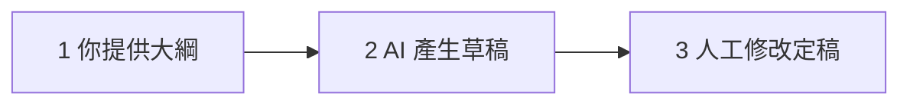
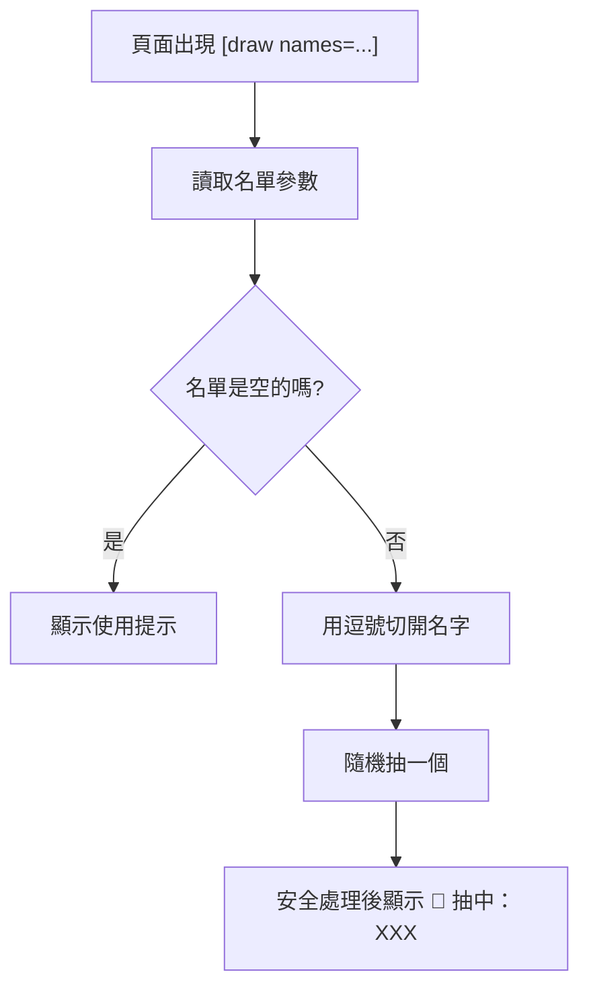
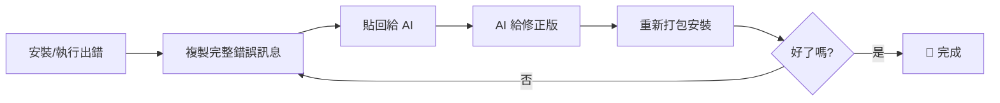

# WordPress 三日工作坊

## Day 3：持續經營與 AI 加值

教育部公民營計劃

講師：Eric Wu｜2026 年 7 月（日期以課程通知為準）

<!--
開場提醒：請學員先打開自己的網站後台登入，今天下午會大量實作。
確認大家 Day 2 的網站都還活著（能登入、能發文）。
-->

---

# Day 1–2 快速回顧：我們已經有一個完整的網站了

- ✅ **Day 1**：自架 WordPress、自有網域、HTTPS 上線
- ✅ **Day 1**：佈景主題挑選與基本版面設定
- ✅ **Day 2**：表單（聯絡我們）、SEO（Yoast）、資安強化
- ✅ **Day 2**：備份（UpdraftPlus）、Elementor 頁面編輯
- ✅ **Day 2**：WooCommerce 商店、Sensei LMS 線上課程

> 換句話說：**技術建置已完成**，接下來的問題是——
> 「這個網站，三個月後還會活著嗎？」

<!--
快速點名 Day 1-2 的成果，讓學員有成就感。
可以請一兩位學員秀一下自己的網站首頁。
順勢丟出「三個月後還活著嗎」這個問題，帶入今天主題。
-->

---

# 今日課表

| 時段 | 內容 |
|------|------|
| 上午 | **第 06 堂：持續經營與網站獲利** |
| | 內容經營心法、視覺素材、SEO 持續優化 |
| | 網站獲利的四種模式 |
| 下午 | **AI 延伸應用** |
| | 第一部：AI 基礎與提示詞入門 |
| | 第二部：AI 協助內容經營（實作：發佈一篇文章） |
| | 第三部：AI 生成圖片素材（實作：文章首圖） |
| | 第四部：用 AI 客製化 WordPress 外掛（壓軸實作） |

<!--
強調下午是「做中學」：每一部都有實作，最後每個人會帶走一個自己做的外掛。
-->

---
layout: center
class: text-center
---

# 今日目標

## 讓網站活下去 🌱 ＋ 讓 AI 當你的助教 🤖

<br>

上午學會「**怎麼經營**」，下午學會「**怎麼省力地經營**」

<!--
一句話總結今天：經營是目的，AI 是手段。
提醒：AI 不會取代老師的專業，但會取代「不用 AI 的工作方式」。
-->

---
layout: section
---

# 第 06 堂

## 持續經營與網站獲利

---

# 6-1 為什麼多數網站三個月後就荒廢？

<v-click>

- 🔥 **熱情期**：剛上線，每天都想改點什麼
- 😐 **冷卻期**：沒人看、沒留言，更新越來越少
- 🪦 **荒廢期**：最後一篇文章停在三個月前

</v-click>

<v-click>

常見原因：

- 把「建好網站」當成終點，而不是起點
- 沒有固定的產出節奏，全憑心情
- 期待立刻有流量，看不到成效就放棄

</v-click>

<!--
可以讓學員自首：以前有沒有經營過部落格/粉專後來荒廢的？通常全場都笑。
重點訊息：荒廢不是因為懶，是因為沒有「系統」。
-->

---

# 經營心態：固定產出節奏

- 內容經營像**運動習慣**：頻率比強度重要
- 建議節奏：**每週一篇**，固定時間寫（例如週日晚上）
- 一篇 800–1500 字就夠，不必每篇都是大作
- 善用 WordPress 的「**排程發佈**」功能：寫好三篇，排程三週
- 給自己一個檢核點：行事曆上寫「每週網站日」

<div class="border-2 border-dashed border-gray-400 rounded-lg p-10 my-4 text-center text-gray-400">
📷 截圖：WordPress 文章編輯器的「排程發佈」設定
</div>

<!--
示範一次排程發佈：發佈按鈕旁的「立即發佈」可以改成未來時間。
老師情境：寒暑假可以一次寫好開學前幾週的內容。
-->

---

# 提供有價值的內容：解決讀者的問題

- 讀者不是來「看你」，是來「**解決自己的問題**」
- 先想：我的讀者是誰？學生？家長？同科老師？
- 他們會在 Google 搜尋什麼問題？
  - 「學習歷程檔案 怎麼寫」
  - 「會計丙級 考試重點」
  - 「高中選組 建議」
- 每篇文章 = 回答一個具體問題

<!--
請學員花 30 秒想：「我的目標讀者，最近最頭痛的一個問題是什麼？」
這個答案就是他們下一篇文章的題目。
-->

---

# 你的教學專業，就是內容金礦 💎

- 你每天在課堂上回答的問題，**就是別人在 Google 搜尋的問題**
- 教了十年的講義、考前重點、常見錯誤整理——都是現成素材
- 別人要花錢買的知識，你已經會了
- 內容來源舉例：
  - 學生最常問的 10 個問題 → 10 篇 FAQ 文章
  - 段考前的重點整理 → 系列文章
  - 帶班、招生、科展的經驗談 → 經驗分享文

<!--
這頁是上午的核心：很多老師覺得「我沒什麼好寫的」，要打破這個迷思。
請學員列出自己「學生最常問的三個問題」，等下 AI 實作會用到。
-->

---

# 易於理解的語言和格式

- 網路閱讀是「**掃描式**」的，不是逐字讀
- 寫作四原則：
  1. **標題層級**：用 H2、H3 切段落，像課本的章節
  2. **短段落**：一段不超過 3–4 行
  3. **條列**：能列點就不要寫成長句
  4. **白話**：想像在跟學生說話，少用術語
- 在 WordPress 編輯器中：選取文字 → 段落樣式 → 標題 2 / 標題 3

<!--
提醒：標題層級不只是排版，也是 SEO（Google 靠 H2/H3 理解文章結構）。
和 Day 2 的 Yoast 可讀性分析呼應：Yoast 會檢查段落長度。
-->

---

# 同一段內容，兩種寫法

### ❌ 牆壁式

> 學習歷程檔案的撰寫首先需要注意的是內容的真實性以及完整性，再來是格式的部分需要注意字數限制以及檔案大小，另外還有繳交期限也很重要，最後是要記得請老師協助檢查……

### ✅ 掃描式

> **學習歷程檔案 3 個重點**
> 1. **內容**：真實、具體，寫出你做了什麼
> 2. **格式**：注意字數與檔案大小上限
> 3. **時程**：提早一週完成，請老師幫你看過

<!--
讓學員直觀感受差異：問大家「哪一個你會想讀完？」
下午用 AI 寫草稿時，可以直接要求 AI 用「掃描式」格式輸出。
-->

---

# 使用吸引人的視覺素材

- 有圖的文章，停留時間與分享率明顯較高
- 每篇文章至少要有：
  - 一張**精選圖片**（首圖，會出現在列表與社群分享）
  - 內文每 2–3 段搭一張圖或截圖
- 圖片來源三條路：
  1. 自己拍、自己做（最安全）
  2. **免費可商用圖庫**（注意授權）
  3. **AI 生成**（下午第三部教）

<!--
精選圖片在 Day 1 教過，可快速複習：文章編輯器右側欄「精選圖片」。
強調：Google 搜尋到的圖「不能直接拿來用」，下一頁講版權。
-->

---

# 版權觀念：老師更要以身作則 ⚖️

- **Google 圖片搜尋到的圖 ≠ 可以免費使用**
- 校園網站、教學部落格也**不是**版權的法外之地
- 認識 **CC 授權（創用 CC）**：
  - `BY` 姓名標示：要寫出作者
  - `NC` 非商業性：不能拿來賺錢
  - `ND` 禁止改作：不能修改
  - `SA` 相同方式分享：改作後要用同樣授權
- 安全做法：用明確標示「可商用、免授權」的圖庫

<!--
常見學員問題：「教學用途不是合理使用嗎？」——公開網站上的使用風險高於課堂內部使用，建議一律用有明確授權的素材。
CC 授權台灣教育圈很常見，老師多半聽過，快速帶過即可。
-->

---

# 使用 Openverse：免費可商用素材搜尋

- 網址：**openverse.org**（WordPress 官方社群維護）
- 搜尋 CC 授權與公眾領域的圖片、音訊
- 可以用篩選器只顯示「**可商業使用**」「**允許改作**」
- 每張圖都附**現成的授權標示文字**，複製貼上即可
- WordPress 編輯器內也能直接搜尋 Openverse 圖片

<div class="border-2 border-dashed border-gray-400 rounded-lg p-10 my-4 text-center text-gray-400">
📷 截圖：Openverse 搜尋結果頁與授權篩選器
</div>

<!--
現場示範：搜尋一個關鍵字（建議用英文，結果較多），點開一張圖，展示「Credit the creator」的現成標示文字。
提醒：英文關鍵字搜尋結果通常比中文多很多。
-->

---

# Openverse 實際操作：三步驟

1. 搜尋關鍵字 → 左側篩選「**Use: Commercial / Modify**」
2. 點選圖片 → 下載 → 複製頁面提供的**授權標示**
3. 上傳到 WordPress 媒體庫 → 在圖片說明（caption）貼上標示

範例標示：

> "Classroom" by example_author is licensed under CC BY 2.0.

<div class="border-2 border-dashed border-gray-400 rounded-lg p-8 my-4 text-center text-gray-400">
📷 截圖：WordPress 媒體庫圖片說明欄位填入授權標示
</div>

<!--
帶學員實際做一次：找一張圖、下載、上傳、貼標示。約 5 分鐘。
卡關點：有學員會找不到授權文字——在圖片詳細頁右側。
-->

---

# SEO 持續優化：關鍵字思維

- Day 2 裝了 Yoast，但 SEO 不是裝了就好，是**持續的習慣**
- 寫文章前先想：「**讀者會搜尋什麼字？**」
- 把那個字放進：
  - 文章標題
  - 第一段內文
  - Yoast 的「焦點關鍵字」欄位
- 用 Google 搜尋框的**自動完成**偷看大家在搜什麼

<div class="border-2 border-dashed border-gray-400 rounded-lg p-8 my-4 text-center text-gray-400">
📷 截圖：Google 搜尋框自動完成建議
</div>

<!--
示範：在 Google 打「學習歷程」看自動完成跑出什麼，那些就是真實搜尋需求。
複習 Day 2：Yoast 焦點關鍵字欄位在文章編輯器下方。
-->

---

# 長尾關鍵字：小池塘裡當大魚 🐟

| | 大關鍵字 | 長尾關鍵字 |
|---|---------|-----------|
| 例子 | 「英文」 | 「高職英文 統測 單字表」 |
| 競爭 | 全世界都在搶 | 競爭者少 |
| 流量 | 很大但輪不到你 | 不大但精準 |
| 適合 | 大型媒體 | **個人網站／老師** |

- 策略：**具體 > 籠統**，瞄準「三到五個字組成」的搜尋詞
- 你的專業越細，長尾優勢越大

<!--
比喻：大關鍵字像在西門町開店，長尾像在學校福利社——人少但全是你的客群。
下午會教用 AI 幫忙發想長尾關鍵字。
-->

---

# 內部連結：讓讀者在你的網站逛下去

- 在文章中連到**自己網站的其他相關文章**
- 好處：
  - 讀者停留更久、看更多頁
  - 幫助 Google 理解網站結構（SEO 加分）
  - 舊文章重新被看見
- 習慣：每篇新文章至少加 **2–3 個內部連結**
- 操作：選取文字 → 工具列連結按鈕 → 搜尋自己的文章標題

<!--
示範編輯器內的連結功能：直接打文章標題關鍵字就能搜到自己的舊文。
提醒：連結文字要有意義（「學習歷程撰寫教學」而不是「點這裡」）。
-->

---

# 6-2 網站獲利：四種主要模式

<v-click>

1. 📰 **廣告**：在網站放廣告，依曝光／點擊計費
2. 🤝 **聯盟行銷**：推薦商品，成交抽成
3. 🛒 **販售商品／課程**：自己的東西自己賣
4. 💼 **贊助與業配**：廠商付費請你介紹

</v-click>

<v-click>

> 共同前提：**先有穩定的內容與流量**，獲利是經營的副產品

</v-click>

<!--
先打預防針：獲利不是今天裝個外掛就有錢進來，是長期經營的結果。
接下來四頁逐一展開。
-->

---

# 模式一：廣告（Google AdSense）

- 原理：在網站版面放 Google 的廣告，**有人看／點就有收入**
- 申請流程：AdSense 官網申請 → Google 審核網站 → 通過後貼上代碼
- 審核重點：原創內容、足夠的文章量、隱私權政策頁面
- 收益現實面：**流量要大才有感**，適合當長期目標
- 收益門檻與分潤比例：以 Google 官網最新規定為準

<!--
誠實告知：一般個人網站的廣告月收入初期可能只有幾十到幾百元，不要過度期待。
常見問題：「審核被拒怎麼辦？」→ 通常是內容太少，先累積 20-30 篇再申請。
-->

---

# 模式二：聯盟行銷（Affiliate Marketing）

- 原理：在文章放**推薦連結**，讀者點連結購買 → 你抽成
- 例子：書籍導購（博客來、momo 聯盟）、線上課程平台推薦
- 適合場景：你本來就會推薦的東西
  - 「我帶班 10 年最推薦的 5 本書」＋ 導購連結
  - 「備課必備的 3 個工具」＋ 推薦連結
- ⚠️ 誠信原則：**只推薦自己真的用過、認同的**，並標示為推薦連結

<!--
強調誠信：老師的信譽是最大資產，亂推薦會賠掉信任。
各平台的聯盟申請方式與抽成比例不同，以各官網為準。
-->

---

# 模式三：販售商品／課程（呼應 Day 2）

- 你的網站已經有 **WooCommerce** 和 **Sensei LMS** 了！
- 可以賣什麼：
  - 📄 **數位商品**：講義 PDF、學習單、模板（零庫存、自動交付）
  - 🎓 **線上課程**：用 Sensei 把專業做成課程
  - 📦 實體商品：班級文創、自製教材

### 模式四：贊助與業配

- 流量穩定後，可能有出版社、教育品牌主動接洽
- 原則同聯盟行銷：誠實標示、符合自身專業

<!--
這頁把 Day 2 裝的外掛「接上商業模式」，學員會很有感：原來那些外掛是為了這個。
提醒：在職教師接案、業配請留意服務學校與相關法規的兼職規定。
-->

---

# 💡 教師情境：教學資源變現與個人品牌

- **教學資源變現**：
  - 你做過的學習單、簡報、題庫，整理上架就是商品
  - 國外行之有年（如教師教材交易平台），台灣正在起步
- **個人品牌經營**：
  - 持續輸出 → 成為某領域「被搜尋得到的老師」
  - 帶來的不只是錢：演講邀約、合作機會、職涯選擇權
- 公開發表也會回頭**逼自己把教材做得更好**

<!--
請留意：販售教材前先確認著作權歸屬（自編 vs 校方資源）與兼職相關規定。
舉幾個台灣教育圈經營個人品牌成功的老師案例（講師自行補充熟悉的例子）。
-->

---

# 第 06 堂小結

- 🌱 網站荒廢的解藥：**固定節奏** ＋ 解決讀者問題的內容
- ✍️ 寫法：標題層級、短段落、條列、白話
- 🖼️ 視覺：每篇都有圖，版權用 **Openverse** 安全解
- 🔍 SEO：長尾關鍵字 ＋ 內部連結，持續累積
- 💰 獲利四模式：廣告／聯盟／販售／業配——**內容先行**

### ✅ Checkpoint：你已經想好「下一篇文章要解決誰的什麼問題」

<!--
休息前快速確認：每位學員心中有一個文章題目了嗎？下午 AI 實作會直接用。
午休前預告：下午請帶著「想寫的題目」回來。
-->

---
layout: section
---

# 下半場

## 讓 AI 當你的助教 🤖

---

# 生成式 AI 是什麼？白話版

- 你可以把它想成一個**讀過超大量文字的接龍高手**
- 它做的事：根據前面的文字，**預測下一個字最可能是什麼**
- 「老師早安，今天要考＿＿」→ 它會接「試」
- 把這個能力放大億萬倍，就能寫文章、翻譯、寫程式
- 這類模型叫 **LLM（大型語言模型）**——名字記不住沒關係

> 重點：它是「**很會接話的助手**」，不是「全知的百科全書」

<!--
文字接龍比喻是今天下午的地基，多花一點時間講。
這個比喻也解釋了等下要講的「幻覺」：接龍接得順，不代表內容是真的。
不需要深入技術，學員聽懂「預測下一個字」就夠了。
-->

---

# 主流工具概覽

| 工具 | 開發公司 | 特色 |
|------|---------|------|
| **ChatGPT** | OpenAI | 知名度最高、生態系完整、內建生圖 |
| **Claude** | Anthropic | 長文處理與寫作、程式碼能力出色 |
| **Gemini** | Google | 與 Google 服務整合（搜尋、文件） |

- 三者都有**免費版**可以直接用，額度與功能**以各官網為準**
- 今天的技巧**三個工具都通用**——學觀念，不是學特定產品
- 建議：先用一個用熟，再比較其他家

<!--
請學員現在就打開其中一個工具並登入，確認能用（教室網路先測）。
不要花時間爭論哪家最強，版本更新很快，今天教的提示詞技巧才是不變的。
-->

---

# AI 的限制（一）：幻覺 👻

- AI 可能**一本正經地胡說八道**——這叫「幻覺」
- 因為它在「接龍」，接得通順 ≠ 內容正確
- 高風險情境：
  - 具體數據、年份、法條、人名
  - 引用文獻、新聞事件
- 對策：**重要事實一律查證**，把 AI 當「初稿產生器」而非「真相來源」

<!--
現場示範一個幻覺：請 AI 介紹一個不存在的東西（例如虛構的法條編號），它常會煞有介事地回答。
老師最有感的例子：請 AI 出題，答案可能是錯的——出題後一定要自己驗算。
-->

---

# AI 的限制（二）：知識截止日與隱私

### 知識截止日

- 模型的知識停在訓練資料的截止時間點
- 最新政策、課綱異動、時事——AI 可能不知道或講錯
- 部分工具可連網搜尋，但仍要查證

### 個資與隱私 🔒

- **不要貼學生個資**：姓名、成績、輔導紀錄、身心狀況
- 輸入的內容可能被用於改善服務（依各家政策而定）
- 原則：**會不好意思貼到公開網路的，就不要貼給 AI**
- 需要範例時用化名：「學生 A」「王小明（化名）」

<!--
隱私這段請放慢講，這是老師身分最重要的紅線（個資法、學生輔導資料保密義務）。
實用技巧：要 AI 幫忙寫評語時，用「一位數學進步但缺交作業的學生」描述特徵，不要貼真名與成績單。
-->

---

# 提示詞（Prompt）基本功：四要素

好的提示詞 = **角色 ＋ 任務 ＋ 脈絡 ＋ 格式**

| 要素 | 說明 | 例子 |
|------|------|------|
| 🎭 角色 | 要 AI 扮演誰 | 「你是高職資料處理科的老師」 |
| 🎯 任務 | 要它做什麼 | 「寫一篇部落格文章」 |
| 📋 脈絡 | 背景與條件 | 「讀者是高一新生，主題是…」 |
| 📐 格式 | 輸出長相 | 「800 字、用 H2 小標、條列重點」 |

> 口訣：**你是誰、做什麼、給背景、長怎樣**

<!--
這是下午最重要的一頁，後面所有實作都用這個框架。
可以讓學員齊唸口訣一次，加深印象。
-->

---

# 壞提示長這樣 ❌

```text
幫我寫一篇文章
```

AI 只能猜，產出通常是：

- 主題籠統、誰都能寫的「罐頭文」
- 長度、語氣、對象全部不對
- 你看了搖頭，覺得「AI 不過如此」

> 其實不是 AI 不行，是**指令太少**。
> 想像你對實習老師只說「幫我上一節課」——他能上好嗎？

<!--
實習老師的比喻會貫穿下午：指令越清楚，產出越好。
可現場示範這個壞提示，讓大家看 AI 產出的罐頭文有多無聊。
-->

---

# 好提示長這樣 ✅

```text
你是一位高職商業經營科老師，經營一個給高中職學生看的學習網站。

請寫一篇部落格文章，主題是「第一次做學習歷程檔案的 5 個常見錯誤」。

讀者是高一學生，對學習歷程還很陌生，容易焦慮。
語氣親切像學長姐建議，避免說教。

格式要求：
- 全文約 1000 字
- 用 H2 小標分段，每個錯誤一段
- 每段給一個具體例子和改進建議
- 結尾用 3 點條列總結
```

<!--
逐行對照四要素：第一段是角色，第二段是任務，第三段是脈絡，最後是格式。
現場執行這個提示詞，跟剛才的壞提示產出並排比較，差異會非常明顯。
-->

---

# 迭代追問：把 AI 當實習生 🔄

- 第一次產出不滿意是**正常的**——不要砍掉重練，**給回饋**
- 追問句型：
  - 「第二段太抽象，**換成高職生的實際例子**」
  - 「語氣太正式，**改得更口語**」
  - 「**保留架構**，但每段縮短一半」
  - 「**用列點重寫**結論」
- 對話有記憶：同一個對話串裡，AI 記得前面的內容
- 通常 **2–3 輪修改**就能到「可用」的程度

<!--
心法：罵 AI「寫得爛」沒有用，要說「哪裡爛、怎麼改」——跟帶實習老師一樣。
提醒：換新對話 AI 就「失憶」了，同一件事盡量在同一串聊完。
-->

---

# 追問實演：一篇文章的三輪進化

1. **第一輪**：用四要素提示詞 → 得到草稿（70 分）
2. **第二輪**：「第三段的例子太普通，換成統測準備的情境」→ 80 分
3. **第三輪**：「整體不錯，把標題改得更吸引高中生，給我 5 個選項」→ 90 分

> 你的角色從「寫作者」變成「**總編輯**」：
> 出題目、給回饋、做最後把關

<!--
現場真的跑這三輪給學員看，全程約 3 分鐘，比任何說明都有說服力。
「總編輯」定位很重要：下一部會再強調人的專業判斷不可取代。
-->

---

# 🙋 小練習：讓 AI 介紹你的學校（10 分鐘）

任務：用**一個提示詞**，讓 AI 寫出一段「介紹自己學校」的文字

要求：

- 用上四要素：**角色、任務、脈絡、格式**
- 脈絡至少包含：學校特色、目標讀者（例如國中生與家長）
- 產出後**檢查有沒有幻覺**（AI 不認識你的學校，特色要自己餵）
- 不滿意就**追問修改一輪**

完成後：把最滿意的版本留著，等下發文章可能用得到

<!--
巡場重點：很多學員會忘記給「脈絡」，AI 就會編造學校特色——這正好示範幻覺。
提醒：AI 幾乎一定不知道你學校的真實資訊，所有特色都要寫進提示詞裡。
時間到請 1-2 位分享他們的提示詞，全班一起看產出。
-->

---
layout: section
---

# AI 延伸第二部

## AI 協助內容經營 ✍️

---

# 用 AI 發想文章主題：從專業展開內容地圖

提示詞範例：

```text
你是內容策略顧問。我是高職餐飲科老師，
想經營一個給「想讀餐飲科的國中生與家長」看的網站。

請幫我規劃內容地圖：
列出 5 個內容主題分類，每個分類給 5 個具體的文章題目。
題目要對應讀者真實會搜尋的問題。
```

- 一次得到 **25 個題目**，挑掉不適合的，剩下就是**半年的文章庫存**
- 把題目存進 WordPress「草稿」，想寫時不怕沒梗

<!--
請學員把科別換成自己的，現場跑一次。
技巧：產出後追問「哪 5 個題目競爭最少、最容易被搜尋到？」結合上午的長尾關鍵字概念。
-->

---

# 內容地圖長這樣

以餐飲科老師為例，AI 可能產出：

| 分類 | 文章題目舉例 |
|------|-------------|
| 選科指南 | 餐飲科在學什麼？一週課表大公開 |
| 證照攻略 | 中餐丙級證照：報名到考試的完整時程 |
| 升學進路 | 餐飲科畢業後的 4 條路 |
| 家長 FAQ | 讀餐飲科以後只能當廚師嗎？ |
| 校園日常 | 實習課的一天：跟著高二生進廚房 |

> 每一格都是一篇文章，**內容荒就此解決**

<!--
讓學員看到「內容地圖」具體的樣子。
提醒：AI 給的題目是起點，要用老師對學生的理解篩選——有些題目看起來漂亮但沒人會搜。
-->

---

# 用 AI 寫文章草稿：三步驟流程



- **步驟 1**：你決定題目與大綱（或請 AI 先列大綱，你刪改）
- **步驟 2**：把大綱餵給 AI，要求依照格式產出草稿
- **步驟 3**：**人工修改**——加入自己的經驗、案例、語氣

> ⚠️ 鐵則：AI 寫的是「草稿」，**沒改過不要按發佈**

<!--
強調步驟 3 不可省略：AI 草稿是通用知識，老師的真實案例與判斷才是文章的靈魂（也是 SEO 上區隔 AI 罐頭文的關鍵）。
Google 並不懲罰 AI 輔助內容，但偏好「有真實經驗與價值」的內容。
-->

---

# 草稿提示詞範本（拿去改）

```text
你是【你的科別】老師，為「【目標讀者】」寫一篇部落格文章。

題目：【文章題目】

大綱：
1. 【小標一】
2. 【小標二】
3. 【小標三】

要求：
- 約 1000 字，繁體中文，台灣用語
- 每個小標用 H2，段落不超過 4 行
- 語氣親切白話，像在跟學生說話
- 結尾條列 3 個行動建議
```

<!--
這是給學員帶回家的萬用範本，【】是要替換的欄位。
等下的實作就用這個範本，現在先帶大家逐欄看一次。
-->

---

# 人工修改：老師的專業判斷不可取代

修改檢查清單：

- ✅ **事實查核**：數據、日期、規定是否正確？（幻覺檢查）
- ✅ **在地化**：是否符合台灣的制度與用語？
- ✅ **加入自己的故事**：一個真實課堂案例，勝過三段通用論述
- ✅ **語氣**：唸一遍，像不像你會說的話？
- ✅ **敏感內容**：有沒有不小心提到可識別的學生資訊？

> AI 提供 70 分的骨架，你的經驗把它變成 95 分

<!--
特別提醒事實查核：升學制度、證照規定這類內容，AI 很常講過時或錯誤的版本。
「加入自己的故事」是讓文章從 AI 味變成人味最有效的一招。
-->

---

# 用 AI 下標題：一次產 10 個再挑

```text
以下是我的文章內容：【貼上文章】

請給我 10 個標題選項，要求：
- 包含關鍵字「學習歷程」
- 其中 3 個用數字型（例如「5 個方法」）
- 其中 3 個用疑問型（例如「你也犯了嗎？」）
- 標題長度 15–25 字
```

- 標題決定點擊率：**好內容配爛標題 = 沒人看**
- 挑選原則：好奇心 ＋ 關鍵字 ＋ 不當標題黨

<!--
示範產 10 個標題，請學員舉手投票選最想點的——通常數字型和疑問型得票高。
提醒：標題要誠實，內容撐不起的承諾不要寫（標題黨會賠掉信任）。
-->

---

# 用 AI 做 SEO（一）：找關鍵字

```text
我寫了一篇文章，主題是「餐飲科學生考中餐丙級證照」。
讀者是高職生。

請列出：
1. 5 個讀者可能搜尋的長尾關鍵字
2. 每個關鍵字背後的搜尋意圖（讀者想解決什麼）
3. 推薦我用哪一個當主要關鍵字，並說明理由
```

- 把選定的關鍵字填入 **Yoast 的「焦點關鍵詞」**欄位
- 再用 Google 自動完成驗證：真的有人這樣搜嗎？

<!--
呼應上午的長尾關鍵字：AI 很擅長發想關鍵字變化，但「真實搜尋量」要用 Google 自動完成交叉驗證。
-->

---

# 用 AI 做 SEO（二）：寫 meta 描述

```text
請為這篇文章寫 3 個 meta 描述（搜尋結果摘要）：
- 80 字以內
- 包含關鍵字「中餐丙級」
- 結尾帶一個讓人想點進來的理由
【貼上文章】
```

- 產出後貼到 **Yoast 的「中繼描述（Meta description）」**欄位
- Yoast 的紅綠燈會告訴你長度是否適中

<div class="border-2 border-dashed border-gray-400 rounded-lg p-8 my-4 text-center text-gray-400">
📷 截圖：Yoast SEO 焦點關鍵詞與中繼描述欄位
</div>

<!--
複習 Day 2：Yoast 欄位在文章編輯器最下方。
meta 描述不直接影響排名，但影響「點擊率」——它是搜尋結果頁的廣告文案。
-->

---

# 用 AI 產社群貼文：一魚多吃 🐟

同一篇文章，改寫成不同平台版本：

```text
以下是我的部落格文章：【貼上文章或網址重點】

請改寫成兩個版本：
1. Facebook 貼文：150 字內，口語、可加表情符號，
   結尾引導點連結看全文
2. Instagram 貼文：100 字內，分 3-4 短行，
   附 5 個適合的 hashtag
```

- 寫一篇文章 = 部落格 ＋ FB ＋ IG 三份內容
- 社群貼文負責**導流**，文章負責**深度**（與 SEO）

<!--
「一魚多吃」是內容經營者的省力核心：一次深度產出，多平台分發。
提醒：FB/IG 貼文記得放回網站文章連結，流量才會回到自己的網站。
-->

---

# 🛠️ 實作：用 AI 完成一篇文章並發佈（30 分鐘）

1. **選題**（3 分）：從早上想的題目或 AI 內容地圖挑一個
2. **產草稿**（7 分）：用草稿提示詞範本，跑出第一版
3. **人工修改**（10 分）：照修改檢查清單，加入自己的經驗
4. **SEO**（5 分）：AI 產標題與 meta 描述，填入 Yoast
5. **發佈**（5 分）：設定精選圖片（暫用 Openverse）→ 按下發佈！

### ✅ Checkpoint：你的網站多了一篇「AI 協作」的文章

<!--
巡場重點：卡最久的通常是步驟 3，有人會想改到完美——提醒「先求發佈，再求完美」。
常見問題：草稿太長爆字數 → 追問 AI「縮到 800 字」。
完成快的學員可以加做：產 FB 貼文版本。
-->

---
layout: section
---

# AI 延伸第三部

## AI 生成圖片素材 🎨

---

# AI 生圖工具概覽

| 工具 | 說明 |
|------|------|
| **ChatGPT（內建生圖）** | 對話中直接生圖、可用中文描述、能連續修改 |
| **Gemini（內建生圖）** | 同樣支援對話式生圖 |
| **Canva AI** | 設計工具內建生圖，適合做社群圖、海報 |
| **Midjourney 等專業工具** | 品質高，但付費且學習曲線較陡 |

- 今天用**對話式工具（ChatGPT 或 Gemini）**示範，門檻最低
- 免費版的生圖張數有限制，**以官網為準**

<!--
教學選擇：用學員已經在用的聊天工具生圖，不另外註冊新服務。
若教室網路慢，生圖可能要等較久，先提醒學員耐心。
-->

---

# 生圖提示詞技巧：四個元素

| 元素 | 說明 | 例子 |
|------|------|------|
| 🎯 主體 | 畫面裡有什麼 | 一間明亮的高中教室，學生在討論 |
| 🎨 風格 | 什麼畫風 | 扁平插畫風／水彩／寫實照片風 |
| 📐 構圖 | 視角與比例 | 橫式 16:9、主體置中、留白給標題 |
| 💼 用途 | 給 AI 脈絡 | 用於教育部落格的文章首圖 |

```text
請生成一張橫式 16:9 的插圖：明亮的高中教室裡，
三位學生圍著筆電討論，扁平插畫風格，色調溫暖，
畫面上方留白。用途是教育部落格的文章首圖。
```

<!--
和文字提示詞一樣的邏輯：講得越具體，產出越接近想像。
提醒：生圖避免要求畫「文字」（中文字常常會變成亂碼圖案）。
-->

---

# 生圖常見地雷與修正

- ❌ 「幫我畫一張好看的圖」→ 跟「幫我寫一篇文章」一樣空泛
- ❌ 圖中的**中文字**常變成亂碼 → 文字後製加（用 Canva 或小畫家）
- ❌ 人物的**手指、文字細節**容易出錯 → 檢查後重生成
- ✅ 不滿意就追問：「同樣構圖，換成水彩風」「把背景改成圖書館」
- ✅ 風格一致性：同網站的首圖用**同一組風格描述**，視覺更專業

<!--
「同一組風格描述」是實用技巧：把滿意的風格句存在記事本，每次生圖重複使用，網站整體視覺會很一致。
-->

---

# 版權與標示：AI 圖片的使用倫理

- AI 生成圖片的著作權**在台灣法律上仍有討論空間**（純 AI 產出可能不受著作權保護）
- 各工具的使用條款不同：商用權限**以官網條款為準**
- 建議做法：
  - 在文章註明「**圖片由 AI 生成**」——誠實是最好的策略
  - 不要生成**真實人物**（名人、同事、學生）的圖像
  - 不要模仿特定藝術家的風格用於公開／商業內容

<!--
法律部分點到為止，重點放在「誠實標示」與「不生成真實人物」兩條可操作的原則。
常見問題：「AI 圖可以拿去賣嗎？」→ 各工具條款不同且法律未定，建議商業用途前先查官網條款。
-->

---

# 學校場景的特別注意點 🏫

- **不要**用 AI 生成可辨識的師生肖像（即使是「畫風」也可能造成困擾）
- 校徽、校名等識別元素，使用前依學校規定
- 教材中使用 AI 圖片：建議標示，培養學生的 AI 素養
- 機會點：這本身就是**很好的教學素材**——
  帶學生討論「這張圖是 AI 生的，你看得出來嗎？」

<!--
把限制轉化為教學機會：AI 識讀（AI literacy）正是現在教育現場的熱門議題。
-->

---

# 🛠️ 實作：為你的文章生成首圖（15 分鐘）

1. 回到剛剛發佈的文章，想像理想中的首圖畫面
2. 用四元素寫生圖提示詞：**主體、風格、構圖（16:9）、用途**
3. 生成 → 不滿意就追問修改（最多三輪，**別陷入完美主義**）
4. 下載圖片（建議檔名用英文，例如 `learning-portfolio-cover.png`）

完成後別關工具，下一步要上傳到網站

<!--
卡關點：有學員會生十幾次還不滿意——設「三輪規則」強制收斂。
檔名用英文是好習慣：避免某些主機環境的中文檔名編碼問題。
-->

---

# 上傳首圖到 WordPress

1. 文章編輯器 → 右側欄「**精選圖片**」→ 設定精選圖片
2. 上傳剛剛的 AI 圖片
3. **替代文字（Alt text）**：描述圖片內容（SEO ＋ 無障礙）
4. 圖片說明可加：「圖片由 AI 生成」
5. 更新文章 → 到前台看效果！

<div class="border-2 border-dashed border-gray-400 rounded-lg p-8 my-4 text-center text-gray-400">
📷 截圖：精選圖片設定與替代文字欄位
</div>

### ✅ Checkpoint：文章有了專屬 AI 首圖

<!--
複習 Day 1 的媒體庫操作，多數學員應該還記得。
替代文字小技巧：可以請 AI 順便寫——「為這張圖寫一句 alt text」。
-->

---
layout: section
---

# AI 延伸第四部（壓軸）

## 不會寫程式，也能做出自己的外掛 🔌

---

# 為什麼這很重要？

- 三天來我們都在**裝別人寫好的外掛**
- 但總有「找不到剛剛好的外掛」的時刻：
  - 想要課堂抽籤工具？外掛庫沒有合用的
  - 想要倒數計時到段考？要嘛太複雜要嘛要付費
- 現在你可以：**用中文描述需求，讓 AI 把它寫出來**
- 這種開發方式有人稱為「**vibe coding**」——
  你出想法和驗收，AI 出程式碼

> 今天結束時，每個人都會帶走一個自己「描述」出來的外掛

<!--
氣氛營造頁：這是三天的壓軸，先讓學員知道終點長什麼樣。
可以先展示成品：一個裝好的抽籤外掛在頁面上運作的樣子。
強調：今天不是學寫程式，是學「跟 AI 溝通需求 + 安全地使用產出」。
-->

---

# WordPress 外掛的最小結構

一個外掛最少只需要：**一個 PHP 檔案 ＋ 一段註解標頭**

```text
my-first-plugin/            ← 資料夾（外掛名）
└── my-first-plugin.php     ← 一個 PHP 檔案
```

- PHP 檔開頭的**註解標頭**告訴 WordPress：「我是一個外掛」
- WordPress 後台「外掛」頁面顯示的名稱、描述，都來自這段標頭
- 沒有標頭 = WordPress 不認得它是外掛

<!--
破除迷思：很多人以為外掛是龐大複雜的東西，其實最小可以小到 10 行。
下一頁直接看 Hello World 的完整程式碼。
-->

---

# 最小外掛範例：10 行的 Hello World

```php
<?php
/**
 * Plugin Name: 我的第一個外掛
 * Description: 用 [hello] 短代碼在頁面顯示一句話
 */

// 這個函式負責回傳要顯示的文字
function my_hello_shortcode() {
    return '哈囉！這是我自己做的外掛 🎉';
}

// 告訴 WordPress：看到 [hello] 就執行上面的函式
add_shortcode( 'hello', 'my_hello_shortcode' );
```

在任何頁面打上 `[hello]`，就會顯示那句話

<!--
逐行解說，但不要陷入 PHP 語法教學：
1. 註解標頭 = 外掛的身分證
2. function = 一個會回傳文字的小機器
3. add_shortcode = 把 [hello] 這個暗號跟小機器綁在一起
shortcode 概念學員在 Day 2 用表單外掛時看過（表單也是用 shortcode 嵌入的），可以呼應。
-->

---

# 你看得懂的部分，其實已經夠多了

剛剛那 10 行裡：

- `Plugin Name:` → 外掛在後台顯示的名字 ✅ 看得懂
- `// 開頭的中文` → 註解，給人看的說明 ✅ 看得懂
- `return '...'` → 回傳引號裡的文字 ✅ 猜得到
- `add_shortcode( 'hello', ... )` → 註冊 `[hello]` 暗號 ✅ 猜得到

> 你不需要會「寫」，只需要會「**讀個大概＋驗收結果**」
> 看不懂的地方？**請 AI 逐行解釋給你聽**

<!--
建立信心的一頁：高中職老師的閱讀理解力綽綽有餘。
示範：把程式碼貼回 AI，說「請逐行用白話解釋給完全不會程式的人聽」。
-->

---

# 主範例：課堂隨機抽籤外掛 🎲

我們要做一個外掛，讓你在頁面上打：

```text
[draw names="小明,小華,小美,阿強"]
```

頁面就會顯示：

> 🎉 抽中：小華

完整流程五步驟：

1. 用提示詞**描述需求**
2. AI **產生程式碼**
3. 存成 **zip**
4. 後台**上傳安裝**
5. 用 shortcode **測試**

<!--
選抽籤而非倒數計時器的原因：不需要 JavaScript，純 PHP 就能完成，程式碼更短更好講解。
先展示成品 demo：重新整理頁面，抽中的人會變，學員會立刻想要。
-->

---

# Step 1：用提示詞描述需求（完整示範）

```text
你是 WordPress 外掛開發專家。
請幫我寫一個完整、可直接安裝的 WordPress 外掛。

需求：
- 功能：提供短代碼 [draw names="名字1,名字2,..."]，
  在頁面上隨機顯示其中一個名字，用於課堂抽籤點名
- 如果沒有提供名單，顯示中文的使用提示
- 程式碼要有繁體中文註解，方便初學者理解
- 遵守 WordPress 安全規範（防止直接存取、輸出跳脫）
- 只需要一個 PHP 檔案，請附上外掛標頭
  （Plugin Name: 課堂隨機抽籤）

最後請告訴我安裝步驟。
```

<!--
帶學員拆解這個提示詞：一樣是四要素（角色/任務/脈絡/格式）。
重點句解說：
- 「可直接安裝」讓 AI 給完整檔案而非片段
- 「繁體中文註解」讓產出可讀
- 「遵守安全規範」是關鍵咒語，AI 會自動加上防護
現場執行它，學員同步跟做。
-->

---

# Step 2：AI 產生的程式碼（上半）

```php
<?php
/**
 * Plugin Name: 課堂隨機抽籤
 * Description: 用 [draw names="小明,小華"] 隨機抽出一位學生
 * Version: 1.0
 * Author: 你的名字
 */

// 安全防護：防止有人直接在瀏覽器打開這個檔案
if ( ! defined( 'ABSPATH' ) ) {
    exit;
}
```

- 標頭：後台「外掛」列表會顯示這些資訊
- `ABSPATH` 檢查：標準安全寫法，**確保檔案只能由 WordPress 載入**

<!--
AI 每次產生的程式碼會略有不同，這是正常的——跟它每次寫的文章也不同一樣。
這頁只講兩件事：標頭是身分證、ABSPATH 是門鎖。不要展開 PHP 語法。
-->

---

# Step 2：AI 產生的程式碼（下半）

```php
// 處理 [draw] 短代碼的函式
function classroom_draw_shortcode( $atts ) {
    // 讀取短代碼參數，names 預設為空字串
    $atts = shortcode_atts( array( 'names' => '' ), $atts );

    // 用逗號把名單切開，並去除多餘空白
    $names = array_filter( array_map( 'trim', explode( ',', $atts['names'] ) ) );

    // 沒有名單時，顯示使用提示
    if ( empty( $names ) ) {
        return '請提供名單，例如 [draw names="小明,小華"]';
    }

    // 從名單中隨機抽出一位，esc_html 防止惡意輸出
    $lucky = $names[ array_rand( $names ) ];
    return '<p>🎉 抽中：' . esc_html( $lucky ) . '</p>';
}
add_shortcode( 'draw', 'classroom_draw_shortcode' );
```

<!--
用白話走流程即可：收到名單 → 切開 → 沒名單就提示 → 隨機抽一個 → 顯示。
esc_html 一句帶過：「輸出前消毒，是 WordPress 的安全好習慣」。
最後一行呼應 Hello World：一樣是 add_shortcode 綁暗號。
-->

---

# 看懂它在做什麼（白話版流程）



> 看不懂任何一行？把程式碼貼回 AI：
> 「**請逐行用白話解釋，我完全不會程式**」

<!--
這頁的目的是「除魅」：程式邏輯其實就是一張流程圖。
再次強調「請 AI 解釋」這個自救技能，後面安全頁會再呼應。
-->

---

# Step 3：把程式碼存成 zip（一）

WordPress 後台上傳外掛，吃的是 **zip 壓縮檔**，結構如下：

```text
classroom-draw/              ← 資料夾
└── classroom-draw.php       ← 把 AI 的程式碼存進這個檔案
```

操作步驟：

1. 開啟「記事本」（Windows）或「文字編輯」（Mac，需設為純文字）
2. 貼上 AI 產生的**完整程式碼**（從 `<?php` 開始）
3. 存檔為 `classroom-draw.php`（**注意副檔名是 .php 不是 .txt**）

<!--
最大卡關點預警：Windows 記事本存檔時，「存檔類型」要選「所有檔案」，否則會變成 classroom-draw.php.txt。
Mac 文字編輯要先「格式 > 製作純文字」，否則存成 rtf 會失敗。
建議講師準備好兩個系統的截圖或現場示範。
-->

---

# Step 3：把程式碼存成 zip（二）

4. 新增資料夾 `classroom-draw`，把 `.php` 檔放進去
5. 對**資料夾**按右鍵 → 壓縮成 zip：
   - Windows：「壓縮至 ZIP 檔案」
   - Mac：「壓縮 classroom-draw」
6. 得到 `classroom-draw.zip` ✅

⚠️ 常見錯誤：

- 只壓縮 `.php` 檔（沒有資料夾）→ 多數情況可裝，但**建議照標準結構**
- 壓縮到「資料夾的上層」，zip 裡多包了一層 → 安裝會失敗

<!--
偷吃步：也可以直接請 AI「給我可以下載的 zip」——部分工具支援產生檔案下載，但手動流程每個人都要會一次，因為不是每個工具都支援。
-->

---

# Step 4：上傳並安裝外掛

後台路徑：**外掛 → 安裝外掛 → 上傳外掛**

1. 點「**上傳外掛**」按鈕（頁面上方）
2. 選擇 `classroom-draw.zip` → 立即安裝
3. 安裝完成 → 點「**啟用外掛**」

<div class="border-2 border-dashed border-gray-400 rounded-lg p-10 my-4 text-center text-gray-400">
📷 截圖：外掛上傳頁面（選擇 zip 檔與「立即安裝」按鈕）
</div>

<!--
卡關點 1：找不到「上傳外掛」按鈕——它在「安裝外掛」頁面的最上方，不在外掛列表頁。
卡關點 2：上傳後出現「無法建立目錄」→ 主機權限問題，請講師協助。
卡關點 3：「The link you followed has expired」→ zip 太大或主機上傳限制，本例檔案極小，通常不會發生。
-->

---

# 啟用成功的樣子

- 外掛列表出現「**課堂隨機抽籤**」，描述正是 AI 標頭裡寫的文字
- 如果啟用時出現**錯誤訊息**：不要慌，這很正常（下一節教除錯）

<div class="border-2 border-dashed border-gray-400 rounded-lg p-10 my-4 text-center text-gray-400">
📷 截圖：外掛列表中「課堂隨機抽籤」已啟用的狀態
</div>

> 💡 看到自己描述出來的外掛出現在列表裡——
> 這一刻，你已經是「外掛開發者」了

<!--
儀式感時刻：請啟用成功的學員舉手，給掌聲。
若有人啟用就白畫面/報錯：先停用（外掛列表還能進的話），帶到除錯章節處理；WordPress 近年版本通常會自動擋下「致命錯誤的外掛」並顯示訊息，不至於整站掛掉。
-->

---

# Step 5：用 shortcode 測試

1. 新增頁面（或編輯任何頁面）
2. 加入「短代碼」區塊，輸入：

```text
[draw names="小明,小華,小美,阿強,小芬"]
```

3. 預覽頁面 → 看到「🎉 抽中：XXX」
4. **重新整理幾次**，抽中的名字會改變 🎲
5. 也試試空名單 `[draw]`，確認提示訊息正常

### ✅ Checkpoint：你的自製外掛正式上線

<!--
驗收思維：步驟 5 測「正常情況」，步驟 5 的 [draw] 測「異常情況」——這就是 QA 的基本概念，順口帶給學員。
玩起來的班級會開始放真實學生名字——提醒：公開頁面別放全名，可用座號或暱稱。
-->

---

# 安全注意事項（一）：環境與備份 🛡️

- **先備份再安裝**：裝自製外掛前，先用 UpdraftPlus 跑一次備份（Day 2 教過）
- **先測試再上線**：理想流程是先在測試環境試
  - 沒有測試環境？至少**避開重要時段**（例如招生季的高峰期）
  - 進階：可用本機 WordPress（如 Studio、Local）當沙盒
- 出問題的最壞情況：用備份還原，網站回到安裝前

> 口訣：**備份 → 安裝 → 測試**，永遠照這個順序

<!--
呼應 Day 2 的 UpdraftPlus：現在學員真正體會到備份的價值了。
補充：若外掛造成後台進不去，可用主機的檔案管理器把外掛資料夾改名，WordPress 就會停用它——這招講師示範或備成講義即可，不用每個人操作。
-->

---

# 安全注意事項（二）：自製外掛的紅線 🚫

- **看不懂的程式碼，請 AI 解釋過再裝**
  - 「這段程式碼會對我的網站做什麼？有沒有風險？」
- 自製外掛**不要碰**這兩類功能：
  - 💳 **金流**：付款、刷卡——交給 WooCommerce 與正規金流服務
  - 🔐 **個資**：學生資料、會員密碼——資安要求遠超自製等級
- 不要安裝**來路不明**的現成外掛程式碼（論壇貼的、別人傳的）
- 自製外掛適合做：顯示型、小工具型、不碰敏感資料的功能

<!--
這頁請嚴肅講。抽籤、倒數、課表這類「顯示型」功能風險低；一旦涉及金流個資，漏洞的代價是真實的法律與信任損失。
判斷原則給學員：這個外掛壞掉或被入侵，最糟會怎樣？答案若是「重新整理就好」就安全，若是「學生資料外洩」就不要做。
-->

---

# 除錯循環：出錯就把錯誤訊息貼回給 AI 🔄



貼錯誤訊息的提示詞：

```text
我安裝你寫的外掛時出現以下錯誤，請解釋原因並給我修正後的完整程式碼：
【貼上完整錯誤訊息】
```

<!--
核心觀念：錯誤訊息不是「失敗」，是「線索」。AI 讀錯誤訊息的能力很強，多數錯誤一輪就能修好。
提醒：請 AI 給「完整修正後的程式碼」而不是「修改片段」，初學者自己合併片段很容易出錯。
-->

---

# 常見錯誤對照表

| 症狀 | 可能原因 | 解法 |
|------|---------|------|
| 上傳後說「無效的外掛標頭」 | 標頭註解格式跑掉 | 確認 `Plugin Name:` 那段完整貼上 |
| 啟用時顯示致命錯誤 | 程式碼複製不完整 | 重新完整複製（含 `<?php`），或貼錯誤給 AI |
| 頁面直接顯示 `[draw...]` 文字 | 外掛沒啟用／shortcode 名稱打錯 | 檢查啟用狀態與拼字 |
| 安裝說「目的地資料夾已存在」 | 重複安裝 | 先刪除舊版外掛再上傳 |
| 存檔變成 `.php.txt` | 記事本存檔類型沒選對 | 存檔類型選「所有檔案」 |

<!--
這張表就是巡場時的急救手冊，學員的問題九成在這五種裡。
最常見的是最後一種（.php.txt），外觀完全看不出來——請學員開啟「顯示副檔名」確認。
-->

---

# 延伸點子清單：下一個外掛做什麼？💡

校園場景的 shortcode 點子（描述需求即可，AI 來寫）：

- ⏳ **段考倒數計時器**：`[countdown date="2026-10-15"]`
- 📋 **學習單下載清單**：自動列出某分類的所有下載檔案
- 🔍 **成績等第換算器**：輸入分數顯示等第（不存資料，純換算）
- 🏫 **教室借用時段表**：顯示固定的週課表
- 💬 **每日一句**：每天自動換一句名言或單字
- 🎯 **分組產生器**：把名單隨機分成 N 組

> 原則：顯示型、不碰個資金流、敘述得清楚就做得出來

<!--
強調「成績等第換算器」是純前端換算、不儲存任何成績——符合前面的紅線原則。
分組產生器是抽籤外掛的自然延伸，適合推薦給想挑戰的學員。
-->

---

# 🛠️ 實作時間：做一個你自己的外掛（30 分鐘）

1. **選題**：從點子清單挑一個，或自己想（守住紅線：顯示型）
2. **寫提示詞**：模仿抽籤範例的提示詞結構
   （角色＋需求＋中文註解＋安全規範＋安裝步驟）
3. **產生 → 打包 → 上傳 → 啟用 → 測試**
4. 出錯就跑**除錯循環**：錯誤訊息貼回給 AI
5. 完成的人：在頁面上展示，等等互相觀摩

### ✅ Checkpoint：網站上跑著一個世界上獨一無二的外掛

<!--
巡場優先處理：zip 結構錯誤、.php.txt、致命錯誤三大宗。
時間不夠的學員：直接做抽籤外掛的變化版（改 emoji、改文字）也算完成。
最後 5 分鐘留給展示：請 2-3 位學員投影自己的外掛，講一下提示詞怎麼下的。
-->

---
layout: section
---

# 三天旅程總結 🏁

---

# 三天，你完成了這些事

| | 主題 | 你帶走的能力 |
|---|------|-------------|
| **Day 1** | 建站 | 自架 WordPress、自有網域、HTTPS、佈景主題 |
| **Day 2** | 強化 | 表單、SEO、資安、備份、Elementor、商店、線上課程 |
| **Day 3** | 經營 ＋ AI | 內容經營、獲利模式、提示詞、AI 寫作、AI 生圖、**自製外掛** |

> 從「沒有網站」到「有一個會經營、能獲利、有 AI 助教的網站」
> ——只花了三天

<!--
帶著學員回顧時，請他們打開自己的網站首頁投影出來，具象化三天成果。
-->

---

# 完整 Checkpoint 總表

- ✅ 網站上線：自有網域 ＋ HTTPS（Day 1）
- ✅ 佈景主題與基本頁面（Day 1）
- ✅ 聯絡表單、Yoast SEO、資安設定（Day 2）
- ✅ UpdraftPlus 自動備份（Day 2）
- ✅ WooCommerce 商店 ＋ Sensei 課程（Day 2）
- ✅ 一篇 AI 協作文章 ＋ AI 生成首圖（Day 3）
- ✅ 一個自製 shortcode 外掛（Day 3）

### 缺哪一項？回去後一週內補完，趁手感還熱

<!--
請學員自己對照打勾，缺項的記在自己的待辦上。
這張表也是講師確認教學目標達成率的工具，可現場舉手統計。
-->

---

# 回去之後：讓網站活下去的最小習慣

- 📝 **每週一篇文**：固定時段，用今天的 AI 流程
  （AI 草稿 → 人工修改 → SEO → 首圖 → 發佈）
- 🔄 **每月一次健檢**（約 15 分鐘）：
  - WordPress 核心、佈景、外掛更新
  - 確認 UpdraftPlus 備份有正常執行
  - 看一眼網站數據：哪篇文章最多人看？
- 📅 現在就打開行事曆，建立這兩個**重複行程**

<!--
請學員當場拿出手機建立行事曆行程——當場做完的執行率遠高於「回去再說」。
每月健檢呼應 Day 2 資安課：沒更新的外掛是最常見的入侵破口。
-->

---

# 延伸學習資源

- 📖 **WordPress 官方文件**：learn.wordpress.org（含中文資源）
- 👥 **台灣 WordPress 社群**：（佔位：講師補充社群名稱與連結）
- 🎪 **WordCamp / 小聚**：（佔位：講師補充近期活動資訊）
- 🤖 **AI 工具官方教學**：各工具官網的 prompt 指南
- 💬 **同學群組**：（佔位：本梯次學員交流群連結／QR code）

<div class="border-2 border-dashed border-gray-400 rounded-lg p-8 my-4 text-center text-gray-400">
📷 截圖：學員交流群組 QR code
</div>

<!--
講師課前準備：填入社群連結與建立學員群組 QR code。
同梯群組是持續經營最有效的支持系統——互相督促發文。
-->

---

# 講師書籍推薦 📚

<div class="border-2 border-dashed border-gray-400 rounded-lg p-10 my-4 text-center text-gray-400">
📷 佔位：書籍封面圖
</div>

- 書名：（佔位：講師自填）
- 適合對象：（佔位：講師自填）
- 購買連結：（佔位：講師自填）

<!--
講師自行決定是否保留此頁；若無推薦書籍可改為「講師聯絡方式」頁。
-->

---
layout: center
class: text-center
---

# Q&A 💬

三天的任何問題，都可以現在問

技術的、經營的、AI 的——或是「回去卡住了找誰」

<!--
常見 Q&A 準備：
1. 「主機/網域到期續約怎麼辦？」→ 回顧 Day 1 的續約時程與費用提醒。
2. 「AI 寫的內容 Google 會處罰嗎？」→ 不會因為「AI 寫」而處罰，但低品質、無價值的內容（不管誰寫）排名都不好。
3. 「自製外掛要更新嗎？」→ 簡單顯示型外掛通常不用，但 WordPress 大版本更新後測一下還能不能用。
4. 留講師聯絡方式或後續支援管道。
-->

---
layout: center
class: text-center
---

# 🎓 恭喜結業！

## 你現在擁有一個自己打造、會經營、有 AI 助教的網站

<br>

三天前它還不存在，三個月後——讓它還活著，而且更好

**每週一篇文，我們網路上見** 🌐

<!--
結業儀式：可以全班一起截圖自己的網站首頁，或合照時投影大家的網站。
最後提醒：今天回家的第一件事——把行事曆上的「每週網站日」設好。
-->
